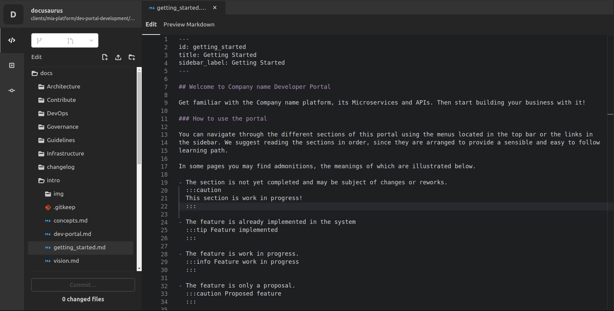

Once you successfully followed the [steps](/runtime-components/applications/dev_portal/application_creation.md) to create the Dev Portal application, you can start adding all information characterizing your organization at the endpoint `/dev-portal-backoffice/`. 

Through the **Backoffice** section of the Dev Portal, you can easily access the documentation repository that will be shown in the Dev Portal Documentation.

## Edit Documentation with Docusaurus

The Dev Portal Documentation section allows users to deeply understand each part of your organization, in the very same way you are gaining information about the Dev Portal in this exact moment.

:::note
[Docusaurus](https://docusaurus.io) is a documentation template that allows you to quickly structure your documentation through the usage of markdown files. It also provides a wide range of additional [markdown features](https://docusaurus.io/docs/markdown-features). 
:::

### Overview

When you create a Dev Portal application, you are also generating a Docusaurus template with a dedicated repository that will help you manage your documentation.

Once you successfully land on the Docusaurus template repository, you can start editing the content that will be shown in the Dev Portal Documentation.

Two main approaches can be used to achieve this goal:

- Cloning the repository on your local machine and directly modifying the content of the files from your IDE or editor of choice;

- Using the editor tool provided by the git provider hosting your repository. 
  
  :::note
  Depending on the git provider used by your organization, the methodologies to edit your documentation may vary. 
  
  Among the most famous providers, Gitlab and Github both provide a web editor interface in which single files can be modified and saved with a commit.
  :::

  Here's an example of how a git provider editor may appear:

  

  By clicking either on the `Edit` or `Web IDE` button, you will be able to edit the documentation with a web text editor: 

  

  Simply press on `Commit` to save your modifications and you are done!

### Structuring your Documentation

As previously mentioned, Docusaurus is based on the usage of **Markdown** files to edit documentation content. However, you will find out that the repository will also include other types of files, such as **Javascript** and **JSON** files. 

:::info
Javascript and JSON files are used to shape the way the documentation is rendered, both for navigation and style.
:::

To add a new section to your documentation, you can edit the `sidebars.json` file. In this file, you can use a tree-shaped structure to define the way sections are subdivided.

For instance, the structure of the Dev Portal documentation will look like this:
```json
{
  "devPortal": [
    {
      "collapsed": true,
      "type": "category",
      "label": "Content Management",
      "items": [
        {
          "type": "doc",
          "id": "dev_portal/marketplace_management"
        },
        {
          "type": "doc",
          "id": "dev_portal/functional_documentation"
        }
      ]
    },
    {
      "type": "doc",
      "id": "dev_portal/requests_management"
    }
  ]
}
```
You can have further details on how to structure your documentation with a sidebar on the official [documentation](https://docusaurus.io/docs/sidebar).

### Editing Page Content

To edit a page content you just have to open a Markdown file and start writing on it. 

You can also use several different features such as:

- **Titles**: putting a number of `#` before your text title;
    
- **infoBoxes**: putting `:::info` before your content and `:::` after.

In addition, start your page with a similar structure:
```markdown
---
id: functional_documentation
title: Functional Documentation
sidebar_label: Functional Documentation
---
```

This formalization will provide:

- the association with the `sidebars.json` structure you defined before;
- the title of the page;
- the label shown in the sidebar for this page (it may differ from the page title).

Learn more about Docusaurus Markdown features on the official [documentation](https://docusaurus.io/docs/markdown-features).
