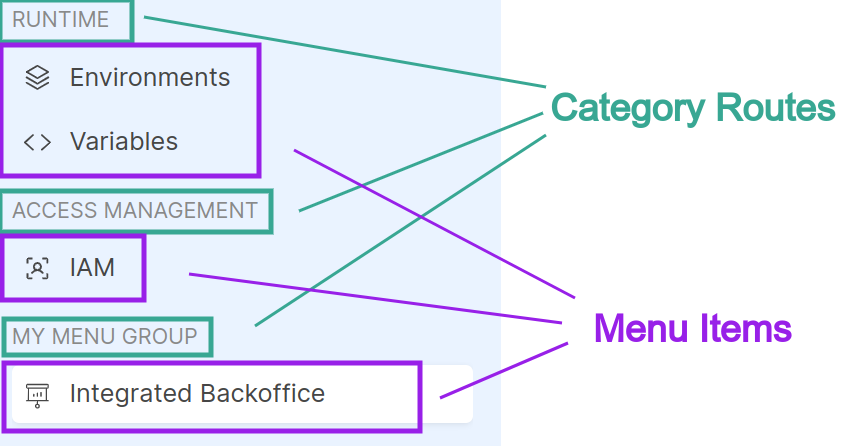

# Register Extensions

Before [activating an extension](/products/console/console-extensibility/activation.md), you must register it on Console. Registered extensions are owned by specific Companies, thus the registration and management operations on extensions can only be performed by a Company Owner.

## How to register your extension?

If you want to register a new extension, you will need to have already chosen the Company that will own it and ensure that you have the role of Company Owner on that Company. Once this is done, the registration can be done via API using the API Portal or via miactl `extensions apply` commands that we recommend.

The route to contact is `PUT /api/extensibility/tenants/{tenantId}/extensions`, which you can find under the tags `Companies` or `Extensibility`.

**Path Params**
- `tenantId`: insert the tenant ID of the Company that will own the new extension

**Body Params**
- `extensionId`: this field should be empty when creating an extension. It is required to edit a extension already registered (see [here](#edit-registered-extension) for more info)
- `name` (_required_): provide the name of your extension
- `activationContexts` (_required_): declare in which contexts the extension can be activated. The selectable values are Company and Project.
- `description`: provide a brief description of the extension
- `entry` (_required_): indicate the website URL that will be embedded on Console. This URL can be parametrized using special keywords that the Console is able to resolve (see the [relative section](/products/console/console-extensibility/locations.md#parametrized-iframe-entry))
- `type` (_required_): select the type of extension. For now, only the `iframe` type is supported
- `permissions`: indicate which permissions users will need to have to see the extension once activated (further details in the [next section](#how-to-restrict-the-extension-usage))
- `destination` (_required_): indicate the location where the extension menu item will be visible and the destination suffix to which you will be redirected when clicking the menu item
- `iconName`: the icon name to use for the extension menu item. 
- `menu` (_required_): the extension menu item info
- `category`: the group menu info where it is placed the extension menu item

**Response**
- `extensionId`: the extension identifies needed to manage the registered extension

:::tip
**[See the example in the tutorial page](/products/console/tutorials/create-extension.md#1-register-backoffice-extension)**
:::

### How to restrict the extension usage?

A registered extension can specify an array of `permissions` that is used to check whether or not a user can see the extension in the Console, once activated. In particular, the user must have **at least one of the required permissions in the array**. You can find the list of allowed permissions to be registered on an extension in the dedicated table inside the [Identity and access management page](/products/console/identity-and-access-management/console-levels-and-permission-management.md#identity-capabilities-inside-console).

### How to configure correctly the extension menu item?

The `destination`, `menu`, `category` and `iconName` should include the necessary information to render the extension menu item on the Console sidebar, which enables access to the extension. The following image shows as the menu item and category are rendered:



**Destination**

The `destination` key is required and should have the following info:
- `id`(_required_): choose a location to place your extension (see the [supported locations](/products/console/console-extensibility/locations.md))
- `path`(_required_): indicate the destination suffix to which you will be redirected when clicking the menu item and it will compose the URL where the iframe will be mounted; in fact, the resulting URL will be composed according to this pattern `<locationPath>/extensions/<extensionId><destinationPath>`.

**Menu**

The `menu` key is required and has the following keys:
- `id` (_required_): a unique identifier that can be used for applying overrides during activation.
- `labelIntl` (_required_): the label to be used on the menu item. This field requires an object JSON `{"en": string, "it": string}` so that the label text is internationalized.
- `order`: it is an optionally numeric value used to sort in ascending order the menu items on the sidebar considering that during the rendering, the `category` menu are sorted first and then the menu items attached on a specific `category` menu.

**Category**

This key is not required, in fact if it is omitted the extension menu item will be placed outside of any group menu. 
The `category` key, if it is defined, has the following info:
- `id` (_required_): it is the identifier of a menu group where you want to attach the menu item. It is possible to choose an existing category id documented on the [supported locations page](/products/console/console-extensibility/locations.md) or create a new `category` specifing also its `labelIntl` and `order`. 
- `labelIntl`: the label to be used on the new category menu item. This field requires an object JSON `{"en": string, "it": string}` so that the label text is internationalized. **It should not be defined if the chosen category id already exists.** 
- `order`: it is an optionally numeric value used to sort in ascending order the category items on the sidebar considering that during the rendering, the `category` menu are sorted first and then the menu items attached on a specific `category` menu. **It should not be defined if the chosen category id already exists.** 


**IconName**
The `iconName` key is optional and configures the icon to use on the extension menu item.
You can find the icons at this [link](https://react-icons.github.io/react-icons/search/), but only Ant, Feather and Phosphor icons are supported. After pick an icon, you can use the React component name represented in the code example (e.g. the Phosphor icon `<PiAirplaneTiltFill />` has `PiAirplaneTiltFill` as name).


## Get registered Extensions by list

The route `GET /api/extensibility/tenants/{tenantId}/extensions` allows you to retrieve all registered extensions under a specific Company. This functionality is readily accessible via miactl `extensions list` command or via the API Portal under the 'Companies' or 'Extensibility' tags, provided you have the Company Owner role for the selected Company.

**Path Params**
- `tenantId`: insert the tenant ID of the Company which you want to retrieve the registered extensions of

**Query Params**
- `resolveDetails`: returns the extension list resolving all the details (`permissions`, `visibilities`, `menu` and `category`) if defined

**Response on success**
Array of registered extensions info.


Extension Info Schema

```json
{
    "extensionId": "string",
    "name": "string",
    "activationContexts": "Array<string>",
    "description": "string",
    "entry": "string",
    "type": "string",
    "destination": {
        "id": "string",
        "path": "string",
    },
    "iconName": "string", 
    "permissions": "Array<string>",
    "visibilities": "Array<{contextType, contextId}>",
    "menu": {
        "id": "string",
        "labelIntl": {"en": "string", "it": "string"},
        "order": "number",
    },
    "category": {
        "id": "string",
        "labelIntl": {"en": "string", "it": "string"},
        "order": "number",
    }
}
```

The `visibilities` key in the response in which specific context the extension is active, instead the other ones are the same info applied when the extension is been registered. This keys are explained above in the [how to register your extension](#how-to-register-your-extension) paragraph.


:::tip
**[See the example in the tutorial page](/products/console/tutorials/create-extension.md#2-check-that-the-new-extension-is-registered)**
:::

## Get registered Extension by ID

You can retrieve also the info of a specific registered extension using the route `GET /api/extensibility/tenants/{tenantId}/extensions/:extensionId`. This API is accessible via miactl `extensions get` command or via the API Portal under the 'Companies' or 'Extensibility' tags, provided you have the Company Owner role for the selected Company.

**Path Params**
- `tenantId`: insert the tenant ID of the Company which you want to retrieve the registered extensions of
- `extensionId`: insert the extension ID of the desired extension

**Response on success**
Array of registered extensions info.


Extension Info Schema

```json
{
    "extensionId": "string",
    "name": "string",
    "activationContexts": "Array<string>",
    "description": "string",
    "entry": "string",
    "type": "string",
    "destination": {
        "id": "string",
        "path": "string",
    },
    "iconName": "string", 
    "permissions": "Array<string>",
    "visibilities": "Array<{contextType, contextId}>",
    "menu": {
        "id": "string",
        "labelIntl": {"en": "string", "it": "string"},
        "order": "number",
    },
    "category": {
        "id": "string",
        "labelIntl": {"en": "string", "it": "string"},
        "order": "number",
    }
}
```

The `visibilities` key in the response in which specific context the extension is active, instead the other ones are the same info applied when the extension is been registered. This keys are explained above in the [how to register your extension](#how-to-register-your-extension) paragraph.


:::tip
**[See the example in the tutorial page](/products/console/tutorials/create-extension.md#2-check-that-the-new-extension-is-registered)**
:::

## Edit registered Extension

The route `PUT /api/extensibility/tenants/{tenantId}/extensions` can be used to edit an already registered extension simply specifying the `extensionId` and providing all the information to apply, including those that should remain unchanged. This route can also be contacted with the miactl `extensions apply` command or with the API Portal under the tags `Companies` or `Extensibility`, ensuring you have the role of Company Owner on the requested Company.

**Path Params**
- `tenantId`: insert the tenant ID of the Company that will own the new extension

**Body Params**
- `extensionId`: this field should be empty when creating an extension. It is required to edit a extension already registered (see [here](#edit-registered-extension) for more info)
- `name` (_required_): provide the name of your extension
- `activationContexts` (_required_): declare in which contexts the extension can be activated. The selectable values are Company and Project.
- `description`: provide a brief description of the extension
- `entry` (_required_): indicate the website URL that will be embedded on Console. This URL can be parametrized using special keywords that the Console is able to resolve (see the [relative section](/products/console/console-extensibility/locations.md#parametrized-iframe-entry))
- `type` (_required_): select the type of extension. For now, only the `iframe` type is supported
- `permissions`: indicate which permissions users will need to have to see the extension once activated (further details in the [next section](#how-to-restrict-the-extension-usage))
- `destination` (_required_): indicate the location where the extension menu item will be visible and the destination suffix to which you will be redirected when clicking the menu item
- `iconName`: the icon name to use for the extension menu item. 
- `menu` (_required_): the extension menu item info
- `category`: the group menu info where it is placed the extension menu item

**Response on success**: 
```
204 No Content
```

The body is the same used to register the extension for the first time and its keys are explained better above in the [how to register your extension](#how-to-register-your-extension) paragraph.

:::tip
**[See the example in the tutorial page](/products/console/tutorials/create-extension.md#edit-the-registered-extension)**
:::

## Remove registered Extension

The route `DELETE /api/extensibility/tenants/{tenantId}/extensions/{extensionId}` can be used to remove an already registered extension. It can be contacted via miactl `extensions delete` command or via API Portal under the tags `Companies` or `Extensibility` and it is required the Company Owner role on the requested Company.

:::info
Deleting an extension automatically deactivates it from all contexts where it was active.
:::

**Path Params**
- `tenantId`: insert the tenant ID of the Company that own the extension to remove
- `extensionId`: insert the ID of the extension to remove

**Response on success**: 
```
204 No Content
```

:::tip
**[See the example in the tutorial page](/products/console/tutorials/create-extension.md#6-remove-definitely-the-backoffice-extension)**
:::
