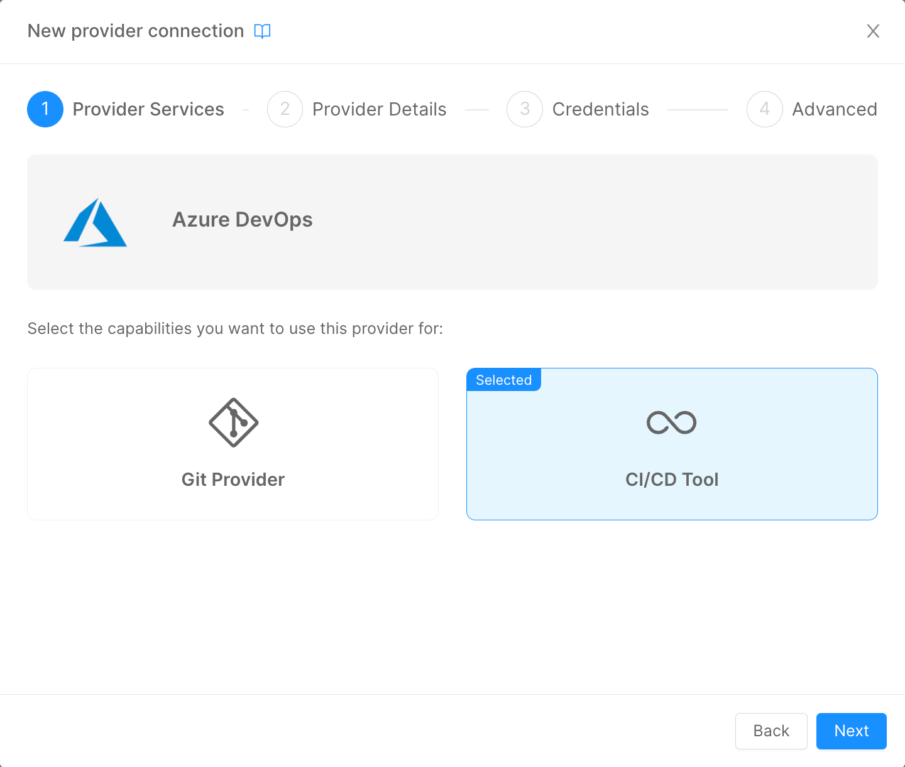

Mia-Platform Console can be configured to deploy your Project using Azure Pipelines.

To deploy your projects using Azure Pipelines, you must add the Azure DevOps Provider on the Company Overview page, select the CI/CD Tool option, and then follow the [standard Provider configuration](/products/console/company-configuration/providers/configure-provider.mdx).



This process will change the configuration of your Company. In particular, the JSON configuration of the field `Pipelines` will change as follows:

```json
{
  "type": "azure-pipelines",
  "providerId": "{{PROVIDER_ID}}"
}
```

Where `PROVIDER_ID` will be equal to the ID of the Azure Pipelines CI/CD Tool Provider that has been setup prior.

When creating a new Project in a Company that has Azure Pipelines as CI/CD Tool Provider, the Console will perform two important actions:
- based on the [Project Template](/products/console/company-configuration/project-blueprint.md) of choice, the Console will read the `azure-pipelines.yml` file and will request to Azure DevOps the creation of a new Pipeline object that will be based on its contents;
- The Project configuration `Pipelines` JSON will be defined as follows:

```json
{
  "type": "azure-pipelines",
  "providerId": "{{PROVIDER_ID}}",
  "azurePipelineId": {{PIPELINE_ID}}
}
```

Where `PIPELINE_ID` will be the unique identifier of the Azure Pipeline created at the first step and that will be used from the Console to trigger the correct one during Deploy operations.

When the user triggers a Deploy from the Console, the Pipeline with this specific ID will be triggered in Azure DevOps.

### Azure Pipelines Basic Configuration

An example of `azure-pipeline.yml` template can be found [here](/docs_files_to_download/azure-pipelines-template.yml).

Let's analyse each section of the above template:
- `trigger: "none"`
This field lets you decide when the pipeline should automatically start. If you want the pipeline to start automatically upon a commit operation on certain branches, you have to update the field as follows:
```yaml
trigger:
  branches:
    include:
    - branch1
    - branch2
```
If you want to automatically start the pipeline when creating a new tag:
```yaml
trigger:
  tags:
    include:
    - '*'
```
In the above example, the pipeline will start automatically upon the creation of any tag, regardless of its name.
With this logic, you can provide custom logic to the pipeline based on the trigger source: you can check it with the instruction <br /> `${{ variables['Build.SourceBranchName'] }}`.

- the `resources` field:
```yaml
resources:
  repositories:
  - repository: pipelines
    type: git
    name: pipelines-templates
    ref: 'master'
```
This instruction lets Azure Pipelines know that you are importing other files from another Team Project in Azure DevOps.
In the example above, we have placed some configuration files and the common logic of the pipeline (check [Template Setup](/products/console/deploy/pipeline-based/configure-azure-pipelines.md#template-setup) for details) in a different Project, in order to have a centralized source of truth where to manage the common logic of all the Deploy pipelines.
:::info
The DevOps Project that you are pointing must be inside the very same DevOps Organization of the one where the Pipeline is running.
:::

- the `jobs` section:
```yaml
jobs:
%#project.environments%
  - deployment: deploy_job_%envId%
    environment: %envId%
    pool:
      vmImage: 'ubuntu-latest'
...
    condition: eq(variables['STAGE_TO_DEPLOY'], '%envId%')
...
%/project.environments%
```
When creating a new Project, the Console uses a template system, to perform some basic interpolations with the configuration of the Company in which the Project is being created.
The idea is to have different `job` named after the environment configured in the Company. The field `condition` will make sure that only the specific job for the target environment will be executed.
This will ensure you to perform different logic based on the Deploy environment.

- the `variables` section allows you to import variables from different sources. In our example, we are importing some variables from the DevOps Project's Variable Group and from the centralized Common Project (check [Variable Group](/products/console/deploy/pipeline-based/configure-azure-pipelines.md#variable-group) for details):
```yaml
    variables:
      - group: mia
      - template: "common/jobs/deploy/variables.yaml@pipelines"
```
In order to store some variables that you want to keep secret, like Tokens to connect to the K8s Cluster, we use the DevOps `Variable Group`, that can be useful to create secret variables that can be shared between every Pipeline of your DevOps Team Project.
With these instructions, you are going to save those variables inside an object called `mia` that can be used in the Pipeline.

- the `strategy` section is the core of the Pipeline, where the Deploy operation are performed:
```yaml
    strategy:
      runOnce:
        deploy:
          steps:
            - checkout: self
            - bash: |
                ...
              env:
                ...
                ## Add here your custom %envId% variables

              name: PrepareEnvVariables

            - template: "common/jobs/deploy/deploy-job.yml@pipelines"
```
In this section, the user can change the content of the `bash` field to prepare the various variables and secrets to be used by `mlp` to perform the Deploy operation.

Under the commented line in the example, the user must specify those secrets variables that are going to be used in his Project. 
You can configure your secrets using a Variable Group, or directly into the Variables section of the Pipeline Editor in Azure DevOps.

:::info
The secrets used by the Microservices in the Console's Project has to be manually assigned only if you don't have access to any Secret Manager Provider.
:::

In the `template` field is specified a template file that contains the common logic performed by `mlp` to apply the Kubernetes manifest into the Runtime cluster.

### mlp Setup
In order to use `mlp` to deploy workloads to Kubernetes via Azure Pipelines, it is necessary to setup a section of the pipeline to download the library and launch its commands to interpolate variables, apply Kustomize patches and deploy the manifests.

We suggest to setup a [Template](/products/console/deploy/pipeline-based/configure-azure-pipelines.md#template-setup) that can be reused in every Project pipeline to avoid duplicating sections of the pipeline.

The steps necessary to run mlp with Azure Pipelines are the following:
- setup a `step` in your pipeline and run a `script` in it;
- download the library via the `wget` command, change its access permission and add the current downloaded folder in the $PATH variable of the Runner;
- run `mlp` commands to generate and deploy the manifest files. Refer to the [mlp Overview](/runtime-components/tools/mlp/10_overview.md) page for more details.

An example of the above process can be found [here](/docs_files_to_download/azure-pipelines-mlp-template.yml).

### Variable Group
Infrastructure Secrets management (variables containing the tokens for Kubernetes connection) in Azure DevOps is handled using Variable Groups. This feature is available at DevOps Project Level and is used to stored values that we don't want to show to our users. Moreover, the variables stored in a Variable Groups are available in every pipelines created in the DevOps Project. 

In order to deploy correctly, `mlp` usually need the following data:
- a variable containing the JWT Token to authenticate `mlp` to the Kubernetes Cluster - one for every Cluster configured in your Company;
- a variable containing the CA to use in the authentication phase to the Kubernetes Cluster - one for every Cluster configured in your Company;
- a set of variables containing the passwords to access your Docker Registries - this variables will be interpolated in the `mlp.yaml` file available in every Configuration repository linked to Console's Projects.

These variables needs to be mapped into the `env` section of the `bash` step in the pipeline and then passed to `mlp`. Since this operation is the same for every Project, it is advised to add this mappings in the Project Template pipeline.

:::caution
The first time you trigger a deploy pipeline in your Project, you need to access Azure DevOps to give the pipeline the permissions to access Variable Groups and Environments. The pipeline will not resume until those accesses are granted. In order to avoid the pipeline from stopping, you need to access Variable Groups and Environments and, in the Security section of these resources, select Open Access to all Pipelines or add the specific pipeline to the list of the authorized resources.
:::

### Template Setup
In the case you want to have a centralize point where to manage the common logic of your deploy pipelines, you can setup a repository (in the same or even in a different DevOps project) to store two files:
- a file containing all of the variables that you want to use
- a file containing the logic to apply the configuration files into the Cluster

All the above files are optional. You can decide to create these or not based on the governance that you want to apply in terms of pipelines management.
