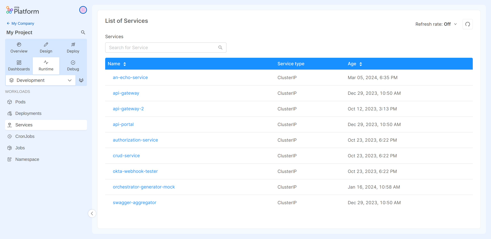
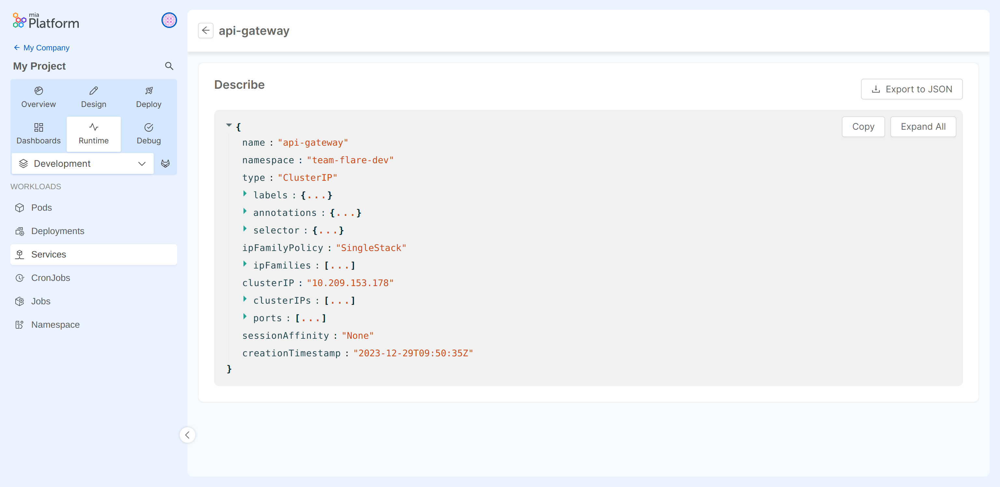

In Kubernetes, a [Service](https://kubernetes.io/docs/concepts/services-networking/service/) is an abstract way to expose an application running on a set of Pods as a network service..

On this section you can monitor all your Services and the relative properties.

## Services Table
The table presented here shows the following information:

* **Name**: the name of the Service.
* **Service Type**: the full list of service types can be found in the [kubernetes documentation](https://kubernetes.io/docs/concepts/services-networking/service/#publishing-services-service-types).
* **Age**: the date when the Service was lastly deployed.

## Inspecting a Service

Selecting the Service name you can inspect more detail about that Service.
  
### Service Describe

In the `Describe` view you can find information about the selected Service in JSON format.
These details are the ones exposed by the [Kubernetes APIs](https://kubernetes.io/docs/reference/kubernetes-api/service-resources/service-v1/).

