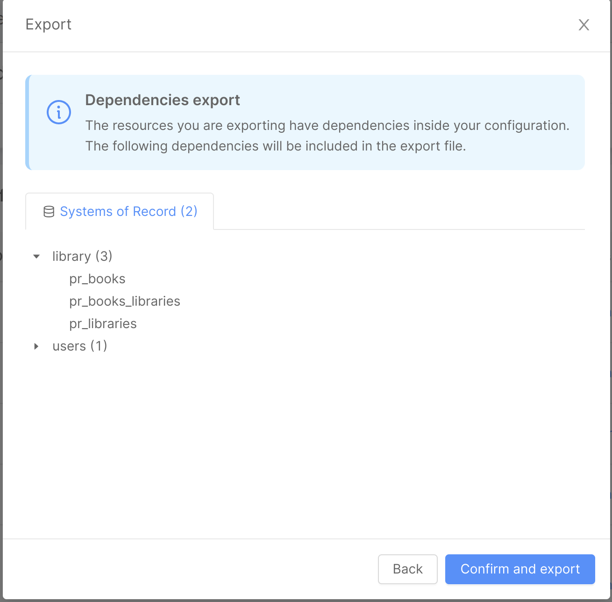
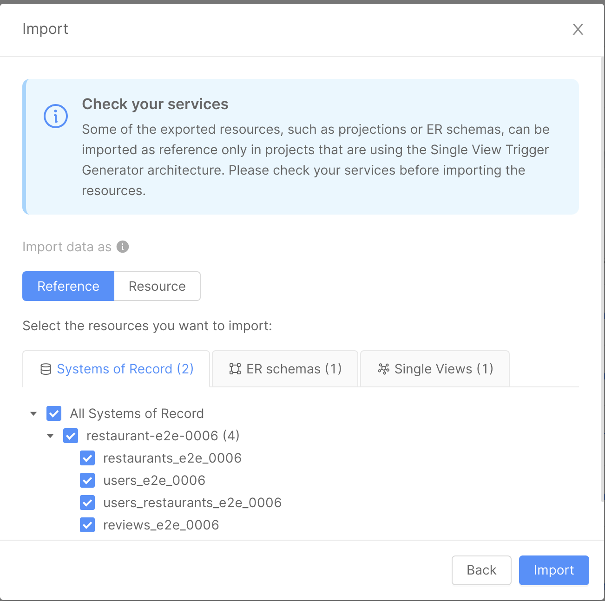

:::info
This feature is available from `v12.0.0` of Mia-Platform Console (you can enable it in the Feature Preview of your Project Settings).
:::

The Import / Export feature allows Fast Data users to export resources from a specific project and import them inside another one.  
This feature makes it easier to access resources from other projects without having to recreate them on each environment.

The following resources can be imported / exported:
- Custom cast functions (assigned to a Projection field)
- ER schemas
- Single Views
- Systems of Record (with all or some of their Projections)

:::caution
Some Fast Data resources, such as **Projections**, can be imported as a reference __only in Projects that are using the [Single View Trigger Generator architecture](/products/fast_data/concepts/architecture.md#event-driven-architecture)__. Please check your services before importing the resources.
:::

The feature can be accessed by clicking on the `Import / Export` button, placed on the top right bar of the Systems of Record and Single Views pages. After clicking on the button, it will be possible to open the `Import` or `Export` modals.

It is also possible to import resources by clicking on the `Import` button displayed on the placeholder screen shown when no Systems of Record or Single Views have been created inside the configuration.

## Export

After clicking on the `Export` button, a modal will display exportable Fast Data resources in their respective tabs, if present.

From each tab it will be possible to select and deselect the resources to be exported.

When clicking on the `Export` button on the modal footer, a `fast-data-export-{export-timestamp}.json` file will be downloaded, containing the selected resources in `JSON` format and some information about the current project, branch and exporting time. This metadata will be useful when importing resources inside another project.

When exporting one or more ER schemas, a check will be performed on the potential related resources (such as Projections and Single Views) to make sure they are exported as well. If not already included in the export selection, another screen will be opened to display all of the ER schemas dependencies. After the `Confirm and export` button is clicked, these dependencies will be included inside the exported file.

If a custom cast function is assigned to one or more Projection fields and the Projection is exported, the cast function will be exported as well.

## Import

After clicking on the `Import` button, it will be possible to upload a `.json` file containing exported data inside a modal.

The imported file should follow the format of files downloaded using the `Export` feature.

If the file is valid, information about the source project, branch and exporting time will be displayed.

When clicking on the `Next` button, all of the Fast Data resources contained inside the imported file will be displayed in their respective tabs. It will be possible to select and deselect resources before completing the import process by clicking on the `Confirm and import` button.

Fast Data resources can be imported in two ways:

1) as a reference: the resources will be referenced inside the current project configuration and displayed in read-only mode. It will be possible to access their data but the resources will not be editable. A `Reference` label will be added to their name inside the Fast Data section: when hovering it, a popover will display information about the exporting source project, branch and time.

2) as a resource: the resources will be copied inside the current project configuration and displayed as if they were created directly inside the current project. It will be possible to access and edit their data.

In both cases, an error message will be displayed if some of the imported resources have the same name of resources or references already existing inside the project current configuration. An edit button will be then displayed to allow the renaming of these resources, unless the resources, in turn, have already been exported from external projects.

It will be possible to update references only by importing resources with the same name and from the same source project. In this case, the `Reference update` label will be displayed alongside each updated resource and its content will be overwritten inside the configuration.

:::caution
Resources imported by reference are not automatically synced  between projects. In order to update them, it will be necessary to manually export them from the source project and import them again inside the destination project.
:::

:::caution
In both cases, microservices associated to each resource (such as Real-Time Updaters and their Message Formats, Single View Creators or Single View Trigger Generators) will NOT be imported. Please make sure these services have been created before deploying your configuration.
:::

## FAQs on Import / Export

When should I use the Import / Export functionality? Please visit the [FAQ page](/products/fast_data/faq/import_export_faq.md) for Import / Export to know the answer to this and other question related to the feature.