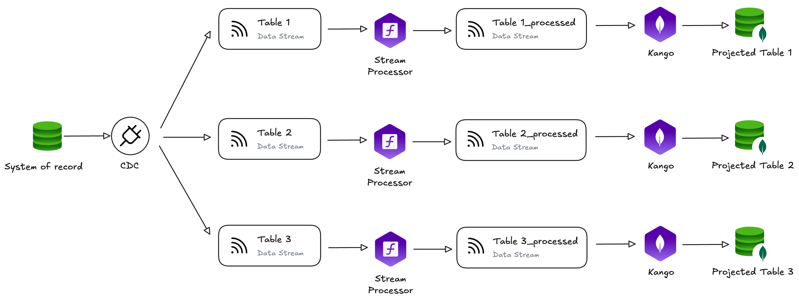

The modular nature of Fast Data Engine v2 workloads enables you to compose pipelines tailored to your specific business needs. Whether you're building data products, modernizing legacy systems, or implementing complex multi-source aggregations, Fast Data v2 provides the flexibility to design the optimal architecture while maintaining clear separation of concerns and operational simplicity.

:::info
The following paragraphs illustrate several Fast Data architecture patterns.  
To fully grasp the core concepts discussed on this page, we recommend reviewing the [Fast Data Engine Presentation](/docs/products/fast_data_v2/fast_data_engine.md) page before proceeding with these examples.
:::

### Single View Data Product Architecture

This is the most common architecture pattern for building **real-time data products** (Single Views) from multiple source systems. The pipeline transforms raw operational data into business-ready insights that can power customer-facing applications and analytics.

**Architecture Flow:**

1. **Data Capture**: CDC (Change Data Capture) extracts changes from the System of Record, streaming data from multiple tables (Table 1 through Table 5) into individual Kafka topics
2. **Stream Transformation**: Each data stream flows through a dedicated Stream Processor instance that:
   - Validates and normalizes data formats
   - Applies business rules and data quality checks
   - Filters irrelevant or invalid records
   - Maps source schemas to standardized formats
3. **Multi-Stream Aggregation**: Farm Data receives all processed streams and:
   - Joins data from multiple sources based on configurable entity relationships
   - Maintains persistent state for incremental aggregation
   - Produces the aggregated Single View row (rowSV_aggregated)
4. **Post-Processing**: A final Stream Processor applies:
   - Business logic transformations specific to the final data product
   - Additional enrichment or derived field calculations
   - Final formatting for downstream consumption
5. **Persistence**: Kango writes the complete Single View to MongoDB, making it available for:
   - Real-time API queries from business applications
   - Analytics and reporting tools
   - Customer-facing user interfaces

### Digital Twin and Legacy Modernization Architecture

When your goal is **system decoupling** and **legacy modernization**, this architecture creates normalized, high-quality digital representations of your operational data without complex aggregation logic.

**Architecture Flow:**

1. **Data Capture**: CDC extracts changes from the legacy System of Record
2. **Independent Processing**: Each source table follows its own transformation pipeline:
   - Stream Processor normalizes and standardizes the data format
   - Applies data quality rules specific to each entity type
   - Maps legacy schemas to modern, standardized data models
3. **Parallel Persistence**: Kango persists each processed stream to its own Projected Table, creating clean digital twins of the source data

**Use Cases:**
- **API Layer Creation**: Expose clean, standardized data APIs while keeping legacy systems unchanged
- **Microservices Migration**: Provide each microservice with its own denormalized data copy, reducing dependencies on the monolithic database
- **Data Quality Improvement**: Transform messy legacy data into clean, well-structured formats without modifying the source system
- **System Isolation**: Insulate downstream applications from legacy system complexity and technical debt

### Advanced Multi-Source Pipeline Architecture

For **complex enterprise scenarios** requiring sophisticated data flows, Fast Data Engine v2 enables advanced architectures that combine multiple patterns while maintaining modularity and operational clarity.

**Architecture Highlights:**

This architecture demonstrates Fast Data Engine v2's maximum flexibility by combining multiple patterns:

- **Multiple Source Systems**: Two independent Systems of Record (Set 1 and Set 2) feed the pipeline through separate CDC instances
- **Parallel Processing Paths**: Different tables follow different processing strategies:
  - Some streams are directly persisted as Digital Twins (Projected Tables)
  - Others are aggregated by Farm Data instances to create Single Views
  - Some undergo multiple transformation stages before reaching their destination
- **Multiple Farm Data Instances**: Different aggregation engines process distinct subsets of data, each maintaining its own state and producing specialized data products
- **Mixed Output Patterns**: The pipeline produces multiple types of outputs simultaneously:
  - Single View 1 and Single View 2 for different business use cases
  - Digital Twin 2 for a specific decoupled data store
  - Intermediate projected tables for debugging or alternative consumption
- **Strategic Stream Processor Placement**: Transformation workloads are positioned exactly where needed:
  - Pre-aggregation for data normalization and quality
  - Post-aggregation for business logic and final formatting
  - Mid-pipeline for routing and enrichment decisions

These architecture patterns demonstrate that Fast Data Engine v2 workloads are not prescriptive building blocks - they are flexible, composable components that you can arrange to match your exact requirements, whether simple or sophisticated.
