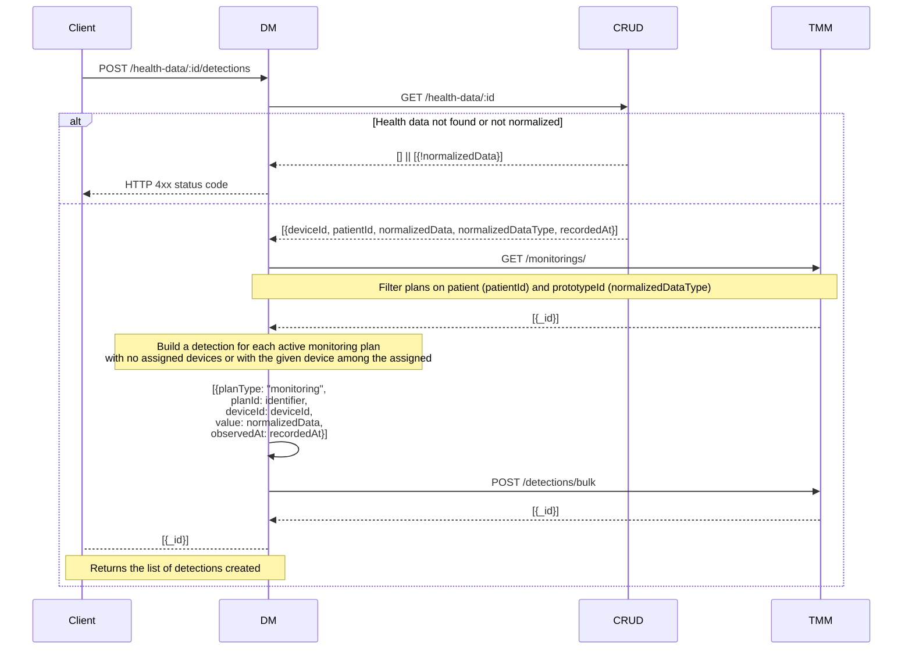

This sections illustrates how you can use the Device Manager.

## Device Management

### POST /devices/assign

Assign a device to a patient

#### Request

The body of the request is required.

```json
{
  "deviceId": "apple-12345",
  "deviceType": "Wearable",
  "name": "Apple Watch",
  "deviceProvider": "apple-healthkit",
  "assignedPatientId": "9c86fda0197f4d0e8780daae45bac2f8",
}
```

#### Response

If the device is assigned correctly to the patient, a response with status code `200` and a body with the the `_id` of the new device is returned.

```json
{
  "_id": "32d85aae8b5c4b42addeb2f932579bda"
}
```

If something goes wrong during the request, the response will have a `3xx`, `4xx` or `5xx` status code and a payload looking like this:

```json
{
  "statusCode": "400",
  "error": "Bad request",
  "message": "Error message"
}
```

### POST /devices/:id/unassign

Unassign the device with given `id` from the patient.

#### Request

The body of the request is empty.

#### Response

If the device is unassigned correctly, a response with status code `204` and empty body is returned

If something goes wrong during the request, the response will have a `3xx`, `4xx` or `5xx` status code and a payload looking like this:

```json
{
  "statusCode": "400",
  "error": "Bad request",
  "message": "Error message"
}
```

## Health Data Management

### GET /health-data

Search and retrieve health data. This is a proxy of the `GET /` endpoint of the [health data CRUD][crud-health-data].

#### Response

A successful response has status code `200` and returns a a list of health data records.

If something goes wrong during the request, the response will have a `4xx` or `5xx` status code and a payload looking like this:

```json
{
  "statusCode": "400",
  "error": "Bad request",
  "message": "Error message"
}
```

### PATCH /health-data/normalize-data/:_id

Normalize the health data with given `_id` and update its `normalizedData` and `normalizedDataType` fields accordingly.

The endpoint fetches the `rawData` and `normalizationRules` and creates the `normalizedData` based on the specified device provider, data type and format.

#### Request

The body of the request is empty.

#### Response

A successful response has status code `200` and returns in the body the updated health data record, like:

```json
{
  "metadata": {
    "correlationId": "f79eae9a-9f64-43da-9292-8725c3dca6a9",
    "receivedTime": "2024-05-21T15:45:59.815903123Z",
    "deviceGroups": [
      "cf_mplus_care"
    ],
    "measurementType": "BloodPressure",
  },
  "device": {
    "id": "deviceId",
    "serialNumber": "001-326171744000008C-0D",
    "IMEI": "900000000000006",
    "IMSI": "204046206994360",
    "manufacturer": "BodyTrace",
    "model": "BT105",
    "timezone": "UTC",
  },
  "measurements": {
    "data": "will be defined based on the measurement type and format"
  }
}
```

If something goes wrong during the request, the response will have a `3xx`, `4xx` or `5xx` status code and a payload looking like this:

```json
{
  "statusCode": "400",
  "error": "Bad request",
  "message": "Error message"
}
```

These are the main error codes and their meaning:

| Error Code | Reasons                                                                               |
|------------|---------------------------------------------------------------------------------------|
| 404        | When the `healthData` is not available, or `healthData` or `healthDataType` not found |
| 400        | When you do not provide the `_id` in the request params                               |
| 500        | If the normalization failed                                                           |

## HealthKit

### POST /health-data/healthkit/:format

This endpoint processes health data received from an [HealthKit][healthkit] device in the specified `format`.

The raw device data is saved, then a response is returned while background jobs are started to normalize and submit health data as detections to all the relevant monitoring plans, following the [data acquisition flow][data-acquisition].

#### Request

The request body must contain an array of raw data from the device in the specified format.

```json
[
  {
    "endDate": "2024-07-23T15:44:05.993+0200",
    "id": "B9480B59-3A05-416C-97CF-E0DE431ADCB5",
    "metadata": {
        "HKMetadataKeyHeartRateMotionContext": 1
    },
    "sourceId": "com.apple.health.142CD7CC-53D1-4C96-8151-D0A5FD7846FE",
    "sourceName": "device’s Apple Watch",
    "startDate": "2024-07-23T15:44:05.993+0200",
    "value": 71
  }
]
```

#### Response

A successful response has status code `200` and returns the array of `_id` of the newly created items.

```json
[
  {
    "_id": "5e8af37ab74dbf0011444ed6"
  },
  {
    "_id": "5e8af37ab74dbf0011444ed7"
  },
  {
    "_id": "5e8af37ab74dbf0011444ed8"
  }
]
```

If something goes wrong during the request, the response will have a `3xx`, `4xx` or `5xx` status code and a payload looking like this:

```json
{
  "statusCode": "400",
  "error": "Bad request",
  "message": "Error message"
}
```

## Medisanté Health Data

### POST /health-data/medisante/:format

This endpoint processes health data received from a [Medisanté][medisante] device in the specified `format`.

The raw device data is saved, then a response is returned while a background job is started to normalize and submit health data as detections to all the relevant monitoring plans, following the [data acquisition flow][data-acquisition].

#### Request

The request body must contain the raw data of the device based on the specified format.

```json
{
  "metadata": {
    "correlationId": "f79eae9a-9f64-43da-9292-8725c3dca6a9",
    "receivedTime": "2024-05-21T15:45:59.815903123Z",
    "deviceGroups": [
      "cf_mplus_care"
    ],
    "measurementType": "BloodPressure",
  },
  "device": {
    "id": "deviceId",
    "serialNumber": "001-326171744000008C-0D",
    "IMEI": "900000000000006",
    "IMSI": "204046206994360",
    "manufacturer": "BodyTrace",
    "model": "BT105",
    "timezone": "UTC",
  },
  "measurements": {
    "data": "will be defined based on the measurement type and format"
  }
}
```

#### Response

A successful response has status code `200` and return in the body the `_id` of the newly created item.

```json
{
  "_id": "5e8af37ab74dbf0011444ed6"
}
```

If something goes wrong during the request, the response will have a `3xx`, `4xx` or `5xx` status code and a payload looking like this:

```json
{
  "statusCode": "400",
  "error": "Bad request",
  "message": "Error message"
}
```

### GET /chart-data

This endpoint returns Medisanté health data in a format suitable for chart visualization using [Care Kit `ck-chart`][ck-chart] component.

#### Request

The request requires the following query parameters:

- `normalizedDataType`: the normalized data type defines the metrics to be displayed in the chart as data series (for example, systolic and diastolic blood pressure) while ensure a consistent schema across health data;
- `_id`: the patient ID, to filters health data related to a specific patient;

You can further restrict the health data shown in a chart with the `type` query parameter, which includes in the chart only data with the given raw data type.

#### Response

A successful response has status code `200` and returns a list of available measurements, like diastolic and systolic blood pressure, which are formatted as chart data series.

```json
[
  {
    "name": "systolicBloodPressure [Pa]",
    "data": [
      {
        "x": 1716819504000,
        "y": 16400
      }
    ]
  },
  {
    "name": "diastolicBloodPressure [Pa]",
    "data": [
      {
        "x": 1716819504000,
        "y": 10533
      }
    ]
  }
]
```

If something goes wrong during the request, the response will have a `3xx`, `4xx` or `5xx` status code and a payload looking like this:

```json
{
  "statusCode": "400",
  "error": "Bad request",
  "message": "Error message"
}
```

## Therapy and Monitoring Manager integration

### GET /detections/chart-data

This endpoint returns health data from [TMM detections][tmm-crud-detections] in a format suitable for chart visualization using [Care Kit `ck-chart`][ck-chart] component.

#### Request

The request accepts a `filters` query parameter containing one or more [Back-kit filters][back-kit-filters] applicable to [TMM detections][tmm-crud-detections].

```json
[
  {
    "name": "systolicBloodPressure [Pa]",
    "data": [
      {
        "x": 1716819504000,
        "y": 16400
      }
    ]
  },
  {
    "name": "diastolicBloodPressure [Pa]",
    "data": [
      {
        "x": 1716819504000,
        "y": 10533
      }
    ]
  }
]
```

For example, you can filter the detections based on a monitoring plan (`planId`) or an observation time range (`observedAt`):

```json
[
  {
    "property":"recordedAt",
    "operator":"between",
    "value":[
      "2023-03-01T12:44:52.428Z",
      "2023-05-31T12:44:55.428Z"
    ]
  },
  {
    "property":"planId",
    "operator":"equal",
    "value":"668253dd1f4092358e249610"
  }
]
```

#### Response

A successful response has status code `200` and returns a list of available measurements, like diastolic and systolic blood pressure, which are formatted as chart data series.

If something goes wrong during the request, the response will have a `3xx`, `4xx` or `5xx` status code and a payload looking like this:

```json
{
  "statusCode": "400",
  "error": "Bad request",
  "message": "Error message"
}
```

### GET /prototypes/

This endpoint retrieves all the normalized health data types with a schema, formatted as [Therapy and Monitoring Manager prototypes][tmm-prototypes].

#### Request

The body of the request is empty.

#### Response

A successful response has status code `200` and returns in the body an array of available normalized health data types converted to the [TMM prototypes schema][tmm-prototypes].

```json
[
  {
    "identifier": "665f0f9127eb03d16985244e",
    "type": "measurements",
    "name": "medisante-BloodPressure",
    "schema": {
      "type": "object",
      "properties": {
        "irregularHeartBeat": {
          "type": "boolean"
        },
        "systolic": {
          "type": "integer",
          "minimum": 60,
          "maximum": 280
        },
        "diastolic": {
          "type": "integer",
          "minimum": 40,
          "maximum": 200
        }
      },
      "required": [
        "systolic",
        "diastolic"
      ]
    }
  }
]
```

If something goes wrong during the request, the response will have a `3xx`, `4xx` or `5xx` status code with a payload looking like this:

```json
{
  "statusCode": "400",
  "error": "Bad request",
  "message": "Error message"
}
```

### POST /health-data/:_id/detections

Submit detections to the Therapy and Monitoring Manager based on health data with given `_id` and TMM monitoring plans.

The endpoint fetches first the `health-data` then the monitoring plans associated to the patient (health data `patientId`) and based on the same prototype (health data `normalizedDataType`) and, if specified, devices. Finally, it automatically submit normalized data as new detections for all active monitoring plans.



#### Request

The body of the request is empty.

#### Response

A successful response has status code `200` and returns in the body a list of `_id` of detections created by the TMM.

```json
[
  {
    "_id": "5e8af37ab74dbf0011444ed6"
  },
  {
    "_id": "5e8af37ab74dbf0011444ed7"
  },
  {
    "_id": "5e8af37ab74dbf0011444ed8"
  }
]
```

If something goes wrong during the request, the response will have a `3xx`, `4xx` or `5xx` status code and a payload looking like this:

```json
{
  "statusCode": "400",
  "error": "Bad request",
  "message": "Error message"
}
```

These are the major error codes and causes.

| Error Code | Reasons                                                                               |
|------------|---------------------------------------------------------------------------------------|
| 404        | When the `healthData` is not available, or `normalizedData` not found                 |
| 400        | When you do not provide the `_id` in the request params                               |
| 500        | If the posting new detection fails                                                    |


[healthkit]: /runtime-components/plugins/device-manager/10_overview.md#apple-healthkit
[medisante]: /runtime-components/plugins/device-manager/10_overview.md#medisanté

[back-kit-filters]: /products/microfrontend-composer/back-kit/40_core_concepts.md#filters
[ck-chart]: /runtime-components/plugins/care-kit/20_components/70_ck-chart.md
[tmm-crud-detections]: /runtime-components/plugins/therapy-and-monitoring-manager/20_configuration.md#detections
[tmm-prototypes]: /runtime-components/plugins/therapy-and-monitoring-manager/20_configuration.md#prototype-data-model

[post-devicesid-unassign]: #post-devicesid-unassign
[post-health-data-medisanteformat]: #post-health-data-medisanteformat
[get-health-data]: #get-health-data
[get-chart-data]: #get-chart-data
[patch-health-data-medisante-update-normalizeDataid]: #patch-health-data-medisante-update-normalizeDataid

[data-acquisition]: /runtime-components/plugins/device-manager/10_overview.md#data-acquisition
[crud-health-data]: /runtime-components/plugins/device-manager/20_configuration.md#health-data
[crud-health-data-types]: /runtime-components/plugins/device-manager/20_configuration.md#health-data-types
