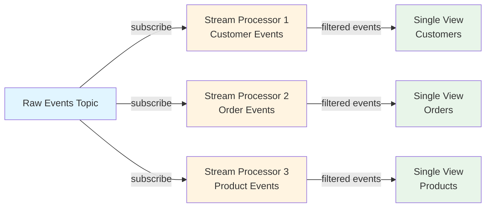

## Requirements

To use the plugin, the following requirements must be met:

- Kafka connection must have permission to read and write the topics declared in the configuration file;
- Kafka topics must exist on the Kafka cluster, with the appropriate number of partitions (which constrain service replicas), retention and replication factor;
- when enabling the `cache` feature, it is necessary to provide
  a connection to a MongoDB cluster and the ad-hoc collection
  should be created with the appropriate indexes;

## Messages Spec

In this section are shown the schemas of each input and output message components.
The service expects those messages to comply with their corresponding schema to
effectively read and transform them.

### Input Message

JSON schema of the **key**:

```json
{
  "oneOf": [
    {
      "type": "string"
    },
    {
      "type": "object",
      "additionalProperties": true
    }
  ]
}
```

:::info

Input key can either be a `string` or a JSON `object`. In both case it will be
deserialized as `string` when given as argument to the processing function.  
As a result, when a key of type `object` is employed, to read it as an object
it is necessary to parse the key using `JSON.parse()` method.

It is recommended, whenever it is possible, to just forward the message key as-is,
so that message order is preserved across the payload transformation.

:::

JSON schema of the **payload**:

```json
{
  "oneOf": [
    {
      "type": "string"
    },
    {
      "type": "object",
      "additionalProperties": true
    },
    {
      "type": "null",
      "description": "tombstone event"
    }
  ]
}
```

:::note

Input message may optionally be compliant with [Fast Data message format](/products/fast_data_v2/concepts.mdx#fast-data-message-format).

:::

#### Input Payload Deserialization

Input payload deserialization is controlled by `payload_serde_strategy` parameter,
which is part of the sandbox configuration in the service configuration file.
Depending on the chosen value, message payloads are deserialized differently before
being passed to the processing function.

In particular, serde strategy accepts one of the following modes:

- **`json` (default)**: Deserializes the payload as a standard JSON object. This is the most common mode for typical JSON payloads;

- **`jsonWithSchema`**: Deserializes JSON content with schema registry compatibility.
  When Kafka uses a schema registry, the actual payload data is nested under a `payload`
  subkey, and this mode handles that structure automatically;

- **`string`**: Deserializes the payload as a raw string without JSON parsing. This is
  useful when you need to process the raw byte content within the sandbox or handle
  non-JSON payloads;

**Configuration Example**

```json
{
  "processor": {
    "type": "javascript",
    "payloadSerdeStrategy": {
      "deserialize": "json"
    }
  }
}
```

Thus, the choice of serde strategy affects how the `message.payload` argument
appears in your processing function:

- with `json` mode: `message.payload` contains the parsed **JSON object**
- with `jsonWithSchema` mode: `message.payload` contains the content from the schema
  registry's payload field as parsed **JSON object**
- with `string` mode: `message.payload` contains the **raw string** representation

### Output Message

JSON schema of the **key**:

```json
{
  "oneOf": [
    {
      "type": "string"
    },
    {
      "type": "object",
      "additionalProperties": true
    }
  ]
}
```

JSON schema of the **payload**:

```json
{
  "oneOf": [
    {
      "type": "object",
      "additionalProperties": true
    },
    {
      "type": "null",
      "description": "tombstone event"
    }
  ]
}
```

:::warning

Here the main takeaway is the fact that output payload MUST be an **object**.

:::

:::note

Output message may optionally be compliant with [Fast Data message format](/products/fast_data_v2/concepts.mdx#fast-data-message-format).

:::

## Processing Function

In this section are described all the details regarding the user-defined processing
function and its most common use cases.

### Function Signature and Data Type

Below are described the function signature, defined by _typescript_ type `ProcessFn`,
alongside the data types involved in its arguments.

```typescript
// ------------------ PROCESSING FUNCTION DATA TYPES ------------------ // 

type ProcessFn<P = unknown> = (
    message: InMessage<P>, caches: ProcessorCaches
) => Promise<OutMessage[] | null | undefined>

interface InMessage<P = unknown> {
    key: string | null | undefined,
    payload: P
}

interface OutMessage {
    key: unknown,
    payload: unknown
}

interface ProcessorCaches {
  (name: string) => ProcessorCache | null | undefined
  hash: {
    md5: {
      digest: (data: string | ArrayBuffer | Uint8Array) => Promise<string>
    },
  }
}

// ------------------ CACHE DATA TYPES ------------------ // 

interface ProcessorCache {
    get: (key: unknown) => Promise<GetResult | null | undefined>,
    set: (key: unknown, value: unknown) => Promise<SetResult>,
    update: (
        key: unknown, value: unknown, version: number
    ) => Promise<UpdateResult>,
    delete: (key: unknown) => Promise<DeleteResult | null | undefined>,
}

interface GetResult {
  op: 'get'
  value: unknown,
  v: number
}

interface SetResult {
  op: 'set',
  v: number
}

interface UpdateResult {
  op: 'update',
  v: number
}

interface DeleteResult {
  op: 'delete',
  value: unknown
}

type CacheError = Error & {message: string} & (
  | { cause: 'NotFound' }
  | {
    cause: 'AlreadyExists'
    payload: {
      value: unknown,
      v: number
    }
  }
  | {
    cause: 'ConcurrentModification',
    paylaod: {
      value: unknown,
      v: number
    }
  }
  | {
    cause: 'Unimplemented',
    payload: {
      op: 'get' | 'set' | 'update' | 'delete'
    }
  }
  | {
    cause: 'Unhandled',
    payload: string
  }
)
```

The above definition translates into the following example function. This represents
the most basic version of a processing function, which just forward input events.

```js
export default function identity({ key, payload }, caches) {
    return [{ key, payload }]
}
```

It is important to notice that the function may output **zero or more** events based
on some user-defined business logic, allowing for a great flexibility

### Mapping

The main goal of the processor function is to transform an input event in one
or more output events. As a result, output events may have a different shape
with respect to the input ones.

```js
export default function transform({ key, payload }) {
  if (!payload) {
    // forward TOMBSTONE event
    return [{ key, payload }]
  }

  return [{ key, payload: mapFields(payload) }]
}

function mapFields(payload) {
  return {
    field_1: Number.parseInt(payload.field1),
    new_const_field: "PUBLIC",
    updatedAt: new Date().toISOString(),
    // other business logic
  }
}
```

### Filtering

Processor function can also be employed to filter out events from the input
stream and retain only the _interested_ or _valid_ ones in the output stream.
This effect can be achieved by setting the function result to a _void_ value.

```js
export default function validate({ key, payload }) {
  if (!payload) {
    // forward TOMBSTONE event
    return [{ key, payload }]
  }
  
  if (!isValid(key, payload)) {
    // no messages are returned, since the input is invalid;
    // consequently no events are forwarded onto the output topic 
    return []
  }

  return [{ key, payload }]
}

function isValid(key, payload) {
  // custom business logic
}
```

:::info

Processor function does not produce any event onto the output topic when
its return value is any of the following:

- `[]` (a list of empty messages)
- `null`
- `undefined`

:::

### Errors

It is important to notice that when the processor function throws an error, or
it rejects a promise that it has returned, the service treats it as an **unexpected
behavior**. Therefore, it **stops the consumption** of the input stream and **terminates**
itself to prevent improper handling of the events.

For this reason, please **ensure** that all the functions or methods that may throw
an error is either wrapped in a `try`/`catch` block or handled using the `.catch()` method
on the promise.

Failing to do so would lead to a stop in the stream
consumption, which would cause the consumer group lag to increase and the losing
of the near real-time capability.

In case this behavior is desired, that is no further processing would occur until
**manual intervention** is applied, it is recommended to set up an alarm on the
consumer group lag of the service. In this manner such situation will not go unnoticed for
a long period of time.  
An alarm can be setup to monitor `kafka_consumer_group_lag` Prometheus metric
[exposed by the service](/products/fast_data_v2/stream_processor/40_Metrics.md).

```js
export default function transform({ key, payload }) {
  if (!payload) {
    // forward TOMBSTONE event
    return [{ key, payload }]
  }
  
  let parsedKey
  try {
    parsedKey = JSON.parse(key)
  } catch (error) {
    // DESIRED EFFECT: skip the input event when key
    //                 cannot be parsed as object
    return []
  }

  // DESIRED EFFECT: in case the function throws, this stream
  //                 processing is terminated until either the input
  //                 event is manually inspected and then skipped
  //                 (update consumer lag) or the function is updated
  //                 to account for such situation
  let updatedPayload = mayThrowFunction(payload)

  return [{ key, payload }]
}

function mayThrowFunction(payload) {
  // custom business logic
}
```

:::note

Manual intervention involves changes either on the stream data, on the consumer
offset or the actual implementation of the processor function.

:::

### Promises

Async processing is supported by the processor function by means of
[`Promise`](https://developer.mozilla.org/en-US/docs/Web/JavaScript/Reference/Global_Objects/Promise)
object.  
Here is an example:

```js
export default function asyncProcessing({ key, payload }, caches) {
  return new Promise((resolve, reject) => {
    asyncTransform()
      .then(result => resolve([{ key, payload: result }]))
      // IMPORTANT: when the async execution throws an error,
      //            the outer promise MUST be resolved or rejected,
      //            depending on your use case, so that underlying
      //            runtime can properly handle the promise execution
      .catch(err => reject(err))
  })
}

async function asyncTransform() {
  // custom business logic
}
```

It is also possible to use [`async function`](https://developer.mozilla.org/en-US/docs/Web/JavaScript/Reference/Statements/async_function) syntax.
The previous example can be expressed as follows:

```js
export default async function asyncProcessing({ key, payload }, caches) {
  try {
    const result = await asyncTransform()
    
    return [{ key, payload: result }]
  } catch(err) {
      // here processing is halted until this event properly process
      throw err
  }
}

async function asyncTransform() {
  // custom business logic
}
```

### Cache Access

As described in the configuration file, the processor function can access an
external cache to enable _stateful stream processing_. In the configuration
file one or more caches can be defined, which are then provided to the function
in the `caches` argument.

The `caches` function allows you to retrieve an underlying cache object by specifying
its identifier that was set in the configuration file. Different cache types support
different operations depending on their implementation.

:::warning

Always verify whether the selected cache object exists. This ensures that _Stream Processor_
service stops its execution due to an unexpected error. This measure prevents
handling input events without the external state available.  
In addition, this check immediately notifies of configuration typos and helps fixing
them quickly.

:::

| Cache Type | Get | Set | Update | Delete | Purpose |
|------------|:---:|:---:|:------:|:------:|---------|
| `mongodb`  | ✔️  | ✔️  |   ✔️   |   ✔️   | Full stateful stream processing with versioning |
| `farmdata` | ✔️  | ❌  |   ❌   |   ❌   | Read-only access to Farm Data service |
| `http-rest`| ✔️  | ❌  |   ❌   |   ❌   | Read-only access to external REST APIs |

All cache methods are **asynchronous operations**. When a cache type doesn't support
a specific operation, calling it will return an `Unimplemented` error.

#### MongoDB Cache

MongoDB cache provides **full CRUD capabilities** (Create, Read, Update, Delete) with support for
versioning and optimistic locking. This is the recommended cache type for comprehensive stateful
stream processing requirements.

**Configuration Example:**

```json
{
  "caches": {
    "customer-cache": {
      "type": "mongodb",
      "url": "mongodb://localhost:27017/fast-data",
      "appName": "eu.miaplatform.fastdata.stream-processor",
      "database": "fast-data",
      "collection": "stream-processor-state"
    }
  }
}
```

**Available Operations:**

- **`get(key)`**: Retrieves value and version associated to the key.
  - Returns `undefined` when no record is found
  
- **`set(key, value)`**: Creates a new cache entry.
  - Throws `AlreadyExists` error if key already exists
  
- **`update(key, value, version)`**: Updates existing entry with optimistic locking.
  - Throws `NotFound` if key doesn't exist
  - Throws `ConcurrentModification` if version doesn't match current stored version
  
- **`delete(key)`**: Removes key and its associated value.
  - Returns `undefined` if key not found

**Usage Example - Complete CRUD Pattern:**

```js
export default async function processWithState({key, payload}, caches) {
  const cache = caches?.("customer-cache")

  if (!cache) {
    throw new Error("customer-cache not found")
  }

  try {
    // GET: Retrieve existing customer state
    const existing = await cache.get(key)

    if (existing) {
      // UPDATE: Modify existing record with optimistic locking
      // The version parameter prevents concurrent modification issues
      await cache.update(
        key,
        {
          ...existing.value,
          lastSeen: new Date().toISOString(),
          totalOrders: (existing.value.totalOrders || 0) + 1
        },
        existing.v  // Current version from previous get
      )
      return [{ key, payload: { status: "updated" } }]
    } else {
      // SET: Create new customer record
      await cache.set(key, {
        customerId: key,
        createdAt: new Date().toISOString(),
        totalOrders: 1
      })
      return [{ key, payload: { status: "created" } }]
    }
  } catch(error) {
    if (error.cause === 'ConcurrentModification') {
      // Handle concurrent modification - skip this message
      // You can implement retry logic if needed
      console.log('Concurrent modification detected, skipping message')
      return []
    }
    if (error.cause === 'AlreadyExists') {
      console.log('Key already exists, using update instead')
      return []
    }
    
    // For other errors, reject to halt processing
    throw error
  }
}
```

**Key Features:**
- **Versioning**: Each entry includes a version number for optimistic locking
- **Concurrent Safety**: The version parameter prevents race conditions between updates
- **Complete CRUD**: Supports all four operations needed for stateful processing

#### FarmData Cache

FarmData cache provides **read-only access** to data stored in the Farm Data service.

**Use Case:** When aggregated data is too large to fit in a single Kafka message, it's stored
in Farm Data. The service sends a message with empty `after` and `before` fields, and you can
use the Kafka key with the FarmData cache to retrieve the full content.

**Configuration Example:**

```json
{
  "caches": {
    "farmdata-cache": {
      "type": "farmdata",
      "url": "http://farm-data-service:3000",
      "head": "aggregations",
      "http2": false
    }
  }
}
```

**Available Operations:**

- **`get(key)`**: Retrieves aggregated data from Farm Data service
  - Returns the complete aggregated object when found
  - Returns `undefined` when no data exists for the key

**Usage Example:**

```js
export default async function retrieveLargeAggregation({key, payload}, caches) {
  const cache = caches?.("farmdata-cache")

  if (!cache) {
    throw new Error("farmdata-cache not found")
  }

  try {
    // GET: Retrieve large aggregated data
    const result = await cache.get(key)

    if (result) {
      return [{ 
        key, 
        payload: {
          ...payload,
          aggregatedData: result.value
        } 
      }]
    }

    // No data found - skip message
    return []
  } catch(error) {
    throw error
  }
}
```

#### HTTP-REST Cache

HTTP-REST cache provides **read-only access** to any external HTTP endpoint, enabling
enrichment of stream events with data from external APIs.

**Configuration Example:**

```json
{
  "caches": {
    "user-enrichment": {
      "type": "http-rest",
      "url": "http://user-service:3000",
      "http2": false,
      "get": {
        "path": "/users/{userId}",
        "method": "GET",
        "headers": [
          { "key": "Authorization", "value": "Bearer token123" }
        ],
        "query": [
          { "key": "includePreferences", "value": "true" }
        ]
      }
    }
  }
}
```

**Available Operations:**

- **`get(key)`**: Performs HTTP GET request to external endpoint
  - Returns the HTTP response body when successful
  - Returns `undefined` when endpoint returns 404

**GET Key Parameter Shape:**

The key argument for GET must be an object with this structure:

```typescript
interface HttpRestCacheGetKey {
  params?: {
    query?: Array<{ key: string; value: string }>;    // Query parameters
    path?: { [key: string]: string };                  // Path parameters
  }
  headers?: Array<{ key: string; value: string }>;     // Request headers
}
```

**Usage Example:**

```js
export default async function enrichUserData({key, payload}, caches) {
  const cache = caches?.("user-enrichment")

  if (!cache) {
    throw new Error("user-enrichment cache not found")
  }

  try {
    // GET: Retrieve user data from external service
    // Path parameter {userId} is replaced with actual value
    const result = await cache.get({
      params: {
        path: { userId: payload.userId },
        query: [
          { key: "includeOrders", value: "true" }
        ]
      },
      headers: [
        { key: "X-Request-ID", value: key }
      ]
    })

    if (result) {
      return [{ 
        key, 
        payload: {
          ...payload,
          user: result.value
        } 
      }]
    }

    // User not found - skip enrichment
    return []
  } catch(error) {
    // HTTP errors should be handled gracefully
    console.error('Failed to enrich user data:', error)
    return []
  }
}
```

### Dead Letter Queue (DLQ) Error Handling

The Stream Processor provides robust error handling capabilities through Dead Letter Queue (DLQ) configuration. When processing errors occur (such as thrown exceptions, timeouts, memory exhaustion, or built-in function failures like `JSON.parse()` or `new URL()`), messages can be automatically sent to a DLQ topic instead of causing the entire processing engine to fail.

This is particularly useful in scenarios where errors need to be captured and potentially handled manually later (e.g., through resubmit) without blocking the processing pipeline. The DLQ approach ensures business continuity while preserving failed messages in their original format for easier troubleshooting and reprocessing.

To know how to configure DLQ, read the related configuration [here](/products/fast_data_v2/stream_processor/20_Configuration.mdx#processor-configuration).

**Example Processing Function:**

```javascript
export default function transformEvent({ key, payload }) {
   
    if (payload.after !== null && payload.after.customer === null) {
        throw new TypeError('invalid assignee')
    }

    return [{key, payload}]
}
```

In this example, when the `customer` validation fails, the original message is sent to the DLQ topic while processing continues with the next message.

### Tombstone Events Management

The service is able to handle tombstone events, that is events whose content is empty
(_empty vector of bytes_), passing them to the processing function with a payload set
to `null`.

As a result, when tombstone events may be expected in the input stream, it is recommended
to check for null equivalence in the processing function. In case such situation arise,
the event can be forwarded as-is, so that the tombstone logic is maintained also across
the output stream.

This check should be carried out as soon as possible within the processing function, as
shown below:

```js
export default function ({ key, payload }) {
  // just forward tombstone events
  if (payload === null) {
    return [{ key, payload }]
  }
  
  // user-defined processing logic

  return [{ key, payload }]
}
```

In case such events should be processed differently, the processor function may
be written to address them according to your business needs.  
For example, a tombstone event may be transformed into a "Fast Data" `DELETE` message,
whose `before` and `after` are set to `null` value. This transformation is useful to
notify a change event of delete when the record's prior value is not available within
the payload of the input event.   

```js
export default function ({key, payload}) {
  // transform tombstone events into "Fast Data" event
  // and forward the original event to maintain the cleanup
  // capability on the Kafka topic
  if (payload === null) {
    return [
      // Fast Data event
      {
        key,
        payload: {
          op: 'd',
          before: null,
          after: null
        }
      },
      // original tombstone event
      {
        key,
        payload: null
      }
    ]
  }

  // user-defined processing logic

  return [{ key, payload }]
}
```

### Sandbox Context

When writing a function that will run within the sandbox, please take into account that
only the following objects are available within its `globalThis` context:

> `Object`, `Function`, `Error`, `EvalError`, `RangeError`, `ReferenceError`,
> `SyntaxError`, `TypeError`, `URIError`, `InternalError`, `AggregateError`, `Iterator`,
> `Array`, `parseInt`, `parseFloat`, `isNaN`, `isFinite`, `queueMicrotask`, `decodeURI`,
> `decodeURIComponent`, `encodeURI`, `encodeURIComponent`, `escape`, `unescape`,
> `Infinity`, `NaN`, `undefined`, `Number`, `Boolean`, `String`, `Math`, `Reflect`,
> `Symbol`, `eval`, `globalThis`, `Date`, `RegExp`, `JSON`, `Proxy`, `Map`, `Set`,
> `WeakMap`, `WeakSet`, `ArrayBuffer`, `SharedArrayBuffer`, `Uint8ClampedArray`,
> `Int8Array`, `Uint8Array`, `Int16Array`, `Uint16Array`, `Int32Array`, `Uint32Array`,
> `BigInt64Array`, `BigUint64Array`, `Float16Array`, `Float32Array`, `Float64Array`,
> `DataView`, `Atomics`, `Promise`, `BigInt`, `WeakRef`, `FinalizationRegistry`,
> `performance`, `console`, `CacheError`

## Event Routing Pattern

When a single Kafka topic contains events that need to be routed to different Single Views
based on their content or type, the recommended pattern is to deploy **multiple Stream Processor
instances**, each subscribing to the same source topic with distinct consumer groups.

Each Stream Processor filters and processes only the messages relevant to its specific Single View,
discarding all others using the filtering capabilities described in the [Filtering section](#filtering-).




When implementing the event routing pattern, consider the following recommendations:

- **Use Distinct Consumer Groups**: Ensure each Stream Processor uses a unique consumer
  group ID so that all instances receive every message from the source topic;
- **Efficient Filtering**: Place filtering logic at the beginning of your processing
  function to minimize unnecessary computation on irrelevant events
