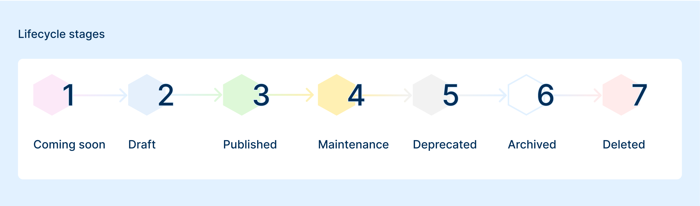

Each item has a predetermined **lifecycle status**:

The following are the various **lifecycle status** an item can go through.

#### **1. Coming Soon**
This state indicates that the item is in its early stages of development. Implementation has just begun, and the component is not yet ready for use by the public. However, users can be informed about its upcoming availability. It serves as a teaser or preview, giving users an idea of new features that are being worked on, but without offering any functionality yet.

#### **2. Draft**
In the *draft state*, the item is available for internal use or testing but is not yet finalized. This release is still subject to change, and both its metadata and assets are open to modification - including for versioned items. The item can be instantiated from the Marketplace, allowing it to be tested in real-world scenarios. However, it is not considered a stable release and should not be used in production environments.

#### **3. Published**
When an item is in the *published state*, it is considered stable, ready for production use, and has passed the necessary validations or review steps. It is available in the Marketplace and can be instantiated by users. In this state, the item is expected to follow a consistent update cycle, including bug fixes, enhancements, and the introduction of new features.

#### **4. Maintenance**
In *Maintenance*, the item is still available, but will not receive any new features or major improvements. It is only supported by bug fixes and critical security patches. This phase has a defined duration, typically 1 year. At the end of the maintenance period, the item may be deprecated or removed from the Marketplace.

#### **5. Deprecated**
An item in the *Deprecated state* is no longer actively maintained: it will not receive bug fixes, new features, or updates. This status indicates that the item is being phased out and a plan for its removal from the Marketplace is in place. Deprecation typically precedes the item's removal, which may occur in a future major release of the console or platform.

If you have already instantiated an item before it was marked as deprecated, it will remain fully operational — no changes will be applied retroactively. However, the item will not benefit from future improvements or maintenance, and users are strongly encouraged to migrate to a supported version or alternative solution.

:::caution
It's important to consider the alternatives to a deprecated item. Using updated and supported items ensures better performance, security, and compatibility.
:::

#### **6. Archived**
When an item enters the *archived phase*, it is no longer available for use and has been completely removed from theMarketplace. The item is retained for historical or record-keeping purposes, but is no longer accessible to users for instantiation or use. 

#### **7. Deleted**
The *deleted state* represents the permanent removal of the item from the system. It is completely deleted, including any associated data, and is no longer available in any form. This action is typically taken by a curator and is irreversible.

