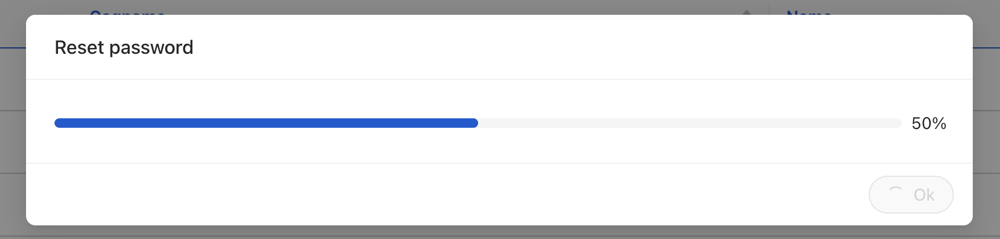

The `ck-reset-password` web component is used for resetting the users password in a bulk activation.
The operation is done by selecting many records from the corresponding users'table and by clicking on the [ck-reset-password-button](/runtime-components/plugins/care-kit/20_components/110_ck-reset-password-button.md).
A job will sequently be created the [user-manager-service][user-manager-service], and the modal will show until the job is not finished.



## Usage

In order to open the ck-import-users-modal in a Microfrontend Composer, a [ck-reset-password-button](/runtime-components/plugins/care-kit/20_components/110_ck-reset-password-button.md) needs to be used on the same page and the minimum configuration of the component must be provided.
An example configuration follows:

```
{
  "type": "element",
  "url": "/mia-care-web-components/mia-care-web-components.esm.js",
  "tag": "reset-password-button",
},
{
  "type": "element",
  "url": "/mia-care-web-components/mia-care-web-components.esm.js",
  "tag": "ck-import-users-modal"
}
```

When open, the 

When the operation completes. A feedback message will be shown indicating the result of the operation, or an error if the procedure failed.

## Properties & Attributes

| property                | type     | required | default | description                                                                                     |
|-------------------------|----------|----------|---------|-------------------------------------------------------------------------------------------------|
| `userManagerServiceUrl` | `string` | false    | /ums    | Path the expose the UserManager Service. The path must not have the trailing slash.             |
| `width`                 | `string` | false    | 600px   | The width of the modal. It must a valid CSS value                                               |
| `height`                | `string` | false    | auto    | The minimum height of the modal. It must a valid CSS value.                                     |
| `pollMaxRetries`        | `number` | false    | 5       | The maximum amount of retries the component will do while waiting for the job completion        |
| `pollIntervalPeriod`    | `number` | false    | 1000    | The period that will occur between two subsequents api call while polling the status of the job |


## Listens to

| event                | action | emits | on error |
|----------------------|--------|-------|----------|
| reset-password-modal | Triggers the opening or the closing of the modal. | - | - |

## Emits

| event                     | description                                                                                                                                     |
|---------------------------|-------------------------------------------------------------------------------------------------------------------------------------------------|
| reset-password-modal | Custom event, the payload equals the current state of the modal (open and loading state, percentage completion, the operation result or error). |

[user-manager-service]: /runtime-components/plugins/user-manager-service/10_overview.md
[events]: https://git.tools.mia-platform.eu/mia-care/platform/plugins/notification-manager/-/blob/master/docs/10_overview.md?plain=0#default-events
