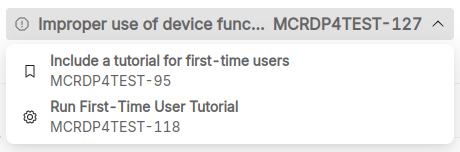

# Software Verification

Ensuring the reliability and safety of Software as a Medical Device (SaMD) requires a balanced approach between automated and manual testing. Automated testing is crucial for early and efficient assessment of software quality, allowing fast execution of unit, integration, and regression tests and ensuring regulatory compliance, such as adherence to IEC 62304 and FDA guidelines, thanks to consistent and continuous validation during the entire software lifecycle.

Manual testing remains relevant, especially for usability and exploratory testing, where human judgment is necessary to evaluate how clinicians and patients interact with the software, and for edge-case validation, ensuring the system correctly handles unexpected inputs or real-world complexities that automated tests might overlook. By combining automation for efficiency and coverage with manual testing for critical judgment and user experience, SaMD developers can create software that is not only compliant and robust but also practical and safe for medical use.

## Overview

P4SaMD provides a comprehensive overview of all the tests planned for a version of the software system.

For each test the following information are provided:

- *Title*: the unique identifier (ID or key) and title of the test;
- *Suggestions*: a list of suggestions generated by P4SaMD (for example if a test has never been executed or is not linked to a requirement);
- *Type*: the type of test, like integration or system;
- *Execution Mode*: if the test is executed automatically or manually;
- *Test Suite*: if the test is part of an [automated test suite](#test-suites);
- *Latest Execution*: details about the last text execution, including when it was performed and the outcome (passed or failed);
- *Software Items*: the number of software items associated to the test;
- *Requirements*: the number of requirements covered by the test.

If you select a row, a detailed view is available with additional information about the test, including:

- who performed the latest execution;
- the full list of text executions;
- the list of linked software items, requirements and risks, that you can explore by clicking on the respective label.

You can navigate between the linked entities - tests, requirements, risks and software items - by selecting them under the *Traceability* section in the detailed view.

You can browse back to previous entities by accessing the history menu at the top of the detailed view and selecting the entity of interest.

## Test suites

P4SaMD enables developers to manage automated tests, including integration and system tests, organized in test suites.

A test suite is a collection of tests that you can managed directly from P4SaMD, although you cannot yet create them directly from the P4SaMD Control Panel.
