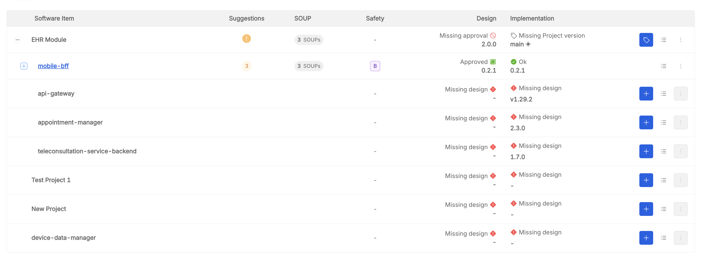
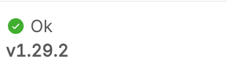
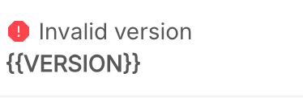

The section allows users to view, create, and edit software items. It provides an intuitive interface for managing software items, including detailed views, adding new entries, and updating existing records. Additionally, using the console, software items are also detected automatically, ensuring efficient and seamless handling of software-related data.

## Create Software Item Design 

1. **Click the "Add software item design" Button**  
   This will open the modal to create a new Software Item.

2. **Fill in the Required Fields**  
   In the modal, you will be prompted to fill out the **Software Item Name** field.  
   When you click on this field, a dropdown will appear. In the dropdown, you can either:  
   - **Enter a new Software Item name**: Type the name you want to assign to the new Software Item and select **Create new**.
   - **Select an existing Software Item**: If a Software Item with the same name and version already exists in the system, you can select it from the list. This will automatically prefill the form with the details of the selected Software Item.
   Fill in the required fields as needed ([Fields description](#fields-description))

3. **Save the New Software Item**  
   Once you've completed the form, click the **"Add software item design"** button at the end of the modal to create and save the new Software Item in the system.

:::tip
You can create a new Software Item starting from an older one: simply select it from the dropdown, then modify the `name` and other fields.
::: 

## Software Items Visualization

### Table

The table shows basic info of the tree of software items:

1. **+/-**: Expand/Collapse Software Item children
2. **Software Item**: Name of the Software Item, clickable if the `Implementation link` is filled.
3. **Suggestions**: Count of the suggestions, hover to show a dropdown with a number of how much is in error and in warning. Clicking open modal in the suggestion tab.
4. **SOUP**: Show a label if the Software Item `Is SOUP` is filled or the number of SOUPS children if there are
5. **Safety**: Show a label containing the Software item Safety class 
6. **Design**: Show design status and version
7. **Implementation**: Show Implementation status and detected version
8. `Fast Action | Detail | Three dots`: 
   - **Edit software item design**: Opens a modal to edit the item, following the guidelines in the ([Fields description](#fields-description)).
   - **Download**: Opens a menu to download History and/or Changelog.
   - **Delete item**: Opens a confirmation modal to delete the item.

**N.B.** Every edit of the software item is reflected in all instances.

### Graph  

The graph provides a visual representation of software items, displaying only the first two levels of the hierarchy. Clicking on a box open the related drawer.

  

Each box contains key details about a software item, including:  
1. **Name** 
2. **Version** 
4. **Count of Suggestions** (shown only if greater than 0)  
3. **Approval Status**
5. **Implementation Status**  
6. **Software Safety Class** (shown only for medical device)

##### **Minimap**  
- The minimap (bottom-right corner) provides an overview of the entire graph, helping users navigate large structures efficiently.  

##### **Caption (Legend)**  
- Located in the top-left corner, the caption explains the different symbols and colors used in the graph, see **Status** of [Software Item States and Related Actions](#software-item-states-and-related-actions) for more infos.

##### **Actions**  
- **Zoom In (+):** Increases the zoom level for a closer view of details.  
- **Zoom Out (-):** Decreases the zoom level for a broader view.  
- **Fit View:** Adjusts the graph to fit within the visible area, ensuring all elements are displayed properly.  

## Software Item States and Related Actions

Depending on the status of the software items, several fast actions are available:

| Status | Button | Description | Action |
|:-------------:|:--------:|-----------|-----------|
||  |The software item is in correct status |
|||The Software Item should be approved|Approve the item, if `SOUP` open a modal to fill required fields|
|||Project \| Service need to be tagged |Redirect to console to create a tag|
|||Version is not following the semantic versioning |Redirect to console to edit a tag|
|| |The Software Item is not implemented in the console  |Redirect to console create Project \| Service|
|||A Software Item was detected but not designed | Open modal to create a Software Item, If a design for a Software Item with the same name and version already exists, open modal to suggest duplicating|
||        |Versions designed and detected are not matched| |
||        |Software Item can't be detected| |

## Software Item Drawer

Clicking on a row or the specific button will open a navigable drawer.

From here, you can approve or disapprove a Software Item.  Additionally, all the actions available from the menu inside the table are accessible here as well, just click on the three dots icon in the top right corner.

This is divided into multiple tabs:
- **Detail**: Displays all the fields entered ([Fields description](#fields-description)) for the Software Item.
- **Traceability**: Shows the linked issues (Requirements, Risks, Integration Tests, Changes), which are clickable.
- **Suggestions**: Displays a list of suggestions, if any, to ensure the Software Item meets the ISO standards.

| # | Reference Requirement | Title | Description |
|-----|-------|-----------|----------|
| 1 |[IEC 62304 **5.3.1**] Transform software requirements into an ARCHITECTURE | Missing architecture reference | Each Software Item of class B or C must include a reference to its architecture. |
| 2 |[IEC 62304 **5.3.2**] Develop an ARCHITECTURE for the interfaces of SOFTWARE ITEMS | Missing interface architecture reference | Each Software Item of class B and class C must include a reference to the architecture of its interfaces. |
| 3 |[IEC 62304 **5.3.3**] Specify functional and performance requirements of SOUP item | Missing functional or performance requirements | Each SOUP Software Item of class B or C must include specified functional and performance requirements necessary for its intended use. |
| 4 |[IEC 62304 **5.3.4**] Specify SYSTEM hardware and software required by SOUP item | Missing system hardware and software requirements | Each SOUP Software Item of class B or C must include the system hardware and software necessary to support the proper operation of the item. |
| 5 |[IEC 62304 **5.4.2**] Develop detailed design for each SOFTWARE UNIT | Missing detailed design | Each Software Item of class C must have a detailed design documented to allow correct implementation. |
| 6 |[IEC 62304 **5.4.3**] Develop detailed design for interfaces | Missing detailed design for interfaces |Each Software Item of class C must include a detailed design for its interfaces with external components and other Software Units |
| 7 |[IEC 62304 **5.6.1**] Integrate SOFTWARE UNITS   [IEC 62304 **5.6.2**] Verify software integration   [IEC 62304 **5.6.3**] Software integration testing   [IEC 62304 **5.6.4**] Software integration testing content   [IEC 62304 **5.6.7**] Integration test record contents| Missing integration tests | Each Software Item of class B or C must be associated with at least one integration test. |
| 8 |[IEC 62304 **8.1.2**] Identify SOUP | Missing Manufacturer in SOUP Software Item | Each SOUP Software Item must include the manufacturer's information. |
| 9 |[IEC 62304 **7.1.1**] Identify SOFTWARE ITEMS that could contribute to a hazardous situation   [IEC 62304 **7.1.2**] Identify potential causes of contribution to a hazardous situation | Missing Risks | Each Software Item of class B or C must be associated with at least one risk |
| 10 | [EU AI Act / FDA / GMLP] Transparency & Explainability Requirement | Missing transparency details | AI-based Software Items must include transparency details such as the AI component toggle and a link to the model card or transparency documentation. |
| 11 | [GMLP] Data Bias Mitigation Requirement | Missing bias mitigation strategy | AI-based Software Items should document strategies for ensuring data diversity and mitigating AI bias. |
| 12 | [EU AI Act / FDA / GMLP] Technical Documentation Requirement | Missing technical documentation | AI-based Software Items must include a link to technical documentation that details the model’s performance, limitations, and integration. |
| 13 | [EU AI Act / GMLP] Model Location & Data Treatment Requirement | Missing model location details | AI-based Software Items must specify where the AI model and its data are hosted. |
| 14 | [EU AI Act / FDA / GMLP] Risk Classification Requirement | Missing risk classification | AI-based Software Items must have a risk classification based on defined risk levels. |
| 15 | [EU AI Act / FDA / GMLP] Risk Control Measures Documentation | Missing risk control rationale | AI-based Software Items must include a documented rationale and control measures for risk mitigation. |

:::warning
If a Software Item is not designed but detected by the system, a warning will appear, and you can proceed with its creation.
:::

## Fields description

- **Software item name**:  Name of Software Item.
   - *Only for creation*
- **Version**: Version of Software Item.
   - *Only for creation*
   - Should follow **semantic versioning** format.
- **Implementation link**: Link to the implementation of the Software Item.
- **Resource type**: Type of the Software Item (project, service, library, or other).
   - *Only for creation*
   - Selectable from the following options: `Project`, `Service`, `Library`, `Other`.
- **Parent software item**: Select the parent Software Items.
   - *Only for creation*
   - Editable only if the Software Item type is `Service` or `Library`.
   - Allows the selection of multiple parent Software Items.
- **Description**: Description of the Software Item.
- **Is medical device**: Flag indicating whether the Software Item is a medical device.
- **Is SOUP**: Flag indicating whether the Software Item is a "Software of Unknown Provenance" (SOUP).
    - Selectable only if the Software Item **IS NOT** of type `Project`.
- **Is AI**: Flag indicating whether the Software Item uses AI-based technologies.
- **Repository ID**: ID of the repository associated with the Software Item.
- **Repository link**: Link to the repository of the Software Item.
- **Architecture reference**: Link to the architecture reference of the Software Item.
- **Interface architecture reference**: Link to the interface architecture reference of the Software Item.
- **Linked requirements**: Requirements associated with the Software Item.
    - Requirements are defined in the provider application.
- **Linked integration tests**: Integration tests associated with the Software Item.
    - Integration tests are defined in the provider application.
- **Linked risks**: Risks associated with the Software Item.
    - Risks are defined in the provider application.
- **Linked changes**: Applicable regulations for the Software Item.
    - Changes are defined in the provider application.

### Medical device

If you select **Is medical device**, the following additional fields are available:

- **Software safety classification**: Safety class of the medical device.
   - Available options: `A`, `B`, `C`.
- **Detailed design reference**: Link to the detailed design documentation.
- **Detailed interface architecture reference**: Link to the detailed interface architecture documentation.

### SOUP

If you select **Is SOUP**, the following additional fields are available:

- **Manufacturer**: Name of the Software Item manufacturer.
- **License**: License of the Software Item.
- **Required hardware and software**: Hardware and Software required for the Software Item.
- **Verification reason**: Reason for verifying the Software Item.

### AI

If you select **Is AI**, the following additional fields are available:

- **AI type**: type of AI technology (`Agent`, `Model`).
- **AI Bias Mitigation Strategies**: measures adopted to address and mitigate AI bias risks.
- **AI Transparency & Explainability**: measures adopted to ensure AI transparency and accountability.
- **Technical Documentation Link/Reference**: link or reference to technical documentation about the model.
- **AI Model/Data Hosting Location**: location of AI hosting and data processing facilities. 
- **AI Risk Classification**: risk level of AI system (`Minimal`, `Limited`, `High Risk`, `Unacceptable`)
- **AI Risk Classification description**: additional information about the risk level for the AI system.

:::warning
Each Software Item is a design of an **instance**; every edit, approval, or disapproval **will be applied to all instances**.

For this reason, you **cannot** create two Software Items with the same `name` and `version`, in that case an error will be displayed. 
:::

:::warning
To **Approve** a Software Item all his children should be approved.
:::