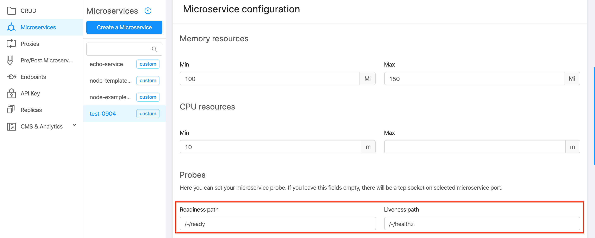
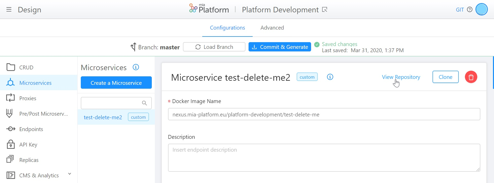

## v5.5.3 (April 22,2020)

### Improvements

* **API Portal**
  Now API Portal is **OpenAPI v3** compliant: all microservice swaggers are converted to OpenAPI v3 automatically. Moreover, APIExplorer has been integrated by adding support for *anyOf*, *oneOf*, *allOf* and *not* schemas. API-Portal service has been **updated to version 1.9.0**.

* **Home**
  Now you can **select your favourite projects** by marking them with the new 'star' button!

  

* **Restyling** of the following sections, introducing the card component: Replicas, API Key and CMS & Analytics.

* Improved **padding and scrolling** of cards and grids in order to enhance their correct visualization.

### Fixed

* **Branches**
  Changes, done from two different people on the same branch, are **no more overwritten**. This fix solves the overwrite case in which one person is modifying an advanced file and the other one is modifying a general configuration on the same branch.

* **API Portal**
  In the section 'Request' of each method, the message **shows the complete string**, and not only string ID.

    

* **Branch Selection**
  During the choice of the Branch, before entering the Design area, the button 'cancel' is **no more selectable with the 'Tab' key** of your keyboard.

* **Design - CRUD**
  In the detail of each CRUD, the creation of an index with more than one field does **not comprimise anymore CRUD configuration**.

* **CMS**
  The 'export' functionality allows you to **download all the records**: there is no more a limit to the number of records to download. Moreover, Crud service has been **updated to version 2.1.4**.

### How to update your DevOps Console

In case of on-premise Console, to use the previous features, you have to update:

* Console website @1.17.2

* Console backend @1.17.1

* Deploy website @1.0.9

* Infrastructure website @1.2.0

* Env var service @1.0.1

## v5.5.2 -1 Patch (April 10,2020)

:::warning
**Design page of DevOps Console was inaccessible cause by an update of GitLab**

With GitLab version 12.9.2 file_path beginning with `/` failed. With this problem, the configuration files of the advanced services cannot be downloaded, so the Design area is inaccessible.
:::

### Fixed

Remove initial `/` to `file_path` on requesting file to gitlab

## v5.5.2 (April 9, 2020)

### Improvements

* **Design - Microservices**  
  When a microservice is created using one of Mia-Platform templates or example, **the probes of that service are already compiled** and contactable by Kubernetes.

   

* Restyling of the following section, introducing the card component: Proxies, Create New Endpoint, API Pre/Post

### Fixed

* **Microservice Gateway Bug in v5.5.1**  
  To resolve it we have updated the following platform components:  

  * cms-backend  v2.0.1 we changed the /client-key response code from 200 to 204;
  * Microservice Gateway v5.1.5 no longer returns status code 500 if a service replies with status code 204.
  
  :::warning
  It is a breaking change for api returning 200 with an empty content-type when `allowUnknownResponseContentType` in microservice-gateway configuration is set to true.
  :::

  * auth-service v1.6.4 returns 204 on API /logout

  * Fix to the menu hover with filters that did not make the text readable

## v5.5.1 (April 6,2020)

:::warning
**Microservice-gateway returns 500** if endpoints return 200 without a response body or 204 with `allowUnknownResponseContentType` to false  
Fixed in v5.5.2
:::

### Improvements

* **Design - Microservices**  
  New you go directly to your git Repository from the DevOps Console selection **"View Repository" button** in microservice detail page.  
  Pay Attention: This button is present only in microservices created from Templates.
  
  At this [link](https://docs.mia-platform.eu/development_suite/api-console/api-design/services/), you can find more details about microservices management.

* **Auth0 - CMS**  
  For each environment, CMS is able to **manage separated users on Auth0Client**: in other words, "Development" users can be seen only on Development environment and "Pre Production" users can be seen only on Pre Production environment. This feature is deployed with the version v2.3.0 of Auth0Client.

* **Log & Monitoring**  
  In the detail of each Pod, the user experience beyond the buttons "Refresh Logs" and "Restart Pod" has been improved.

  At this [link](https://docs.mia-platform.eu/development_suite/monitoring/monitoring/), you can find more details about Logs and Pods Monitoring.

* **Design - Microservices**  
  Restyling of the card of microservice, created from Template or from Docker Image.

### Fixed

* **Microservice Gateway 5.1.3**  
  Now Microservice Gateway is able to manage the **error created when content-type is not correct**.

## v5.5.0 (March 31,2020)

### Improvements

* **Design - Microservices**  
  During Microservice creation, **default values for GroupName are created**.  
  The initial selection of GroupName is on "Services", but, if needed, it can be changed.
  
  At this [link](https://docs.mia-platform.eu/development_suite/api-console/api-design/custom_microservice_get_started/), you can find more details about microservice creation from Template.

* **Design - Microservices**  
  Now you can **clone code repository directly from DevOps Console** selecting Clone button on Microservice design page. Clone supports both ssh and https.  
  Pay attention: this button is present only in microservices created from DevOps Console.
  
  At this [link](https://docs.mia-platform.eu/development_suite/api-console/api-design/services/), you can find more details about microservices management.

### Fixed

* **Design**
   **Titles in the Launcher** are not aligned with the titles of the Console sections.

* **Design - Microservices**
   **Card and Card's titles** in Microservices Details are not aligned.

* **Design - CRUD/Microservices/Pre&Post**
   During the typing of a description of a Collection, Microservice or Decorator, an error appears when a "space" is typed. The **description validators are removed**.

* **Design - Crud/Proxies/Endpoints**
   When the user wants to see the field's and type's detail, they seem to be disabled. **Border, cursor, color and background** of the input element are changed.
