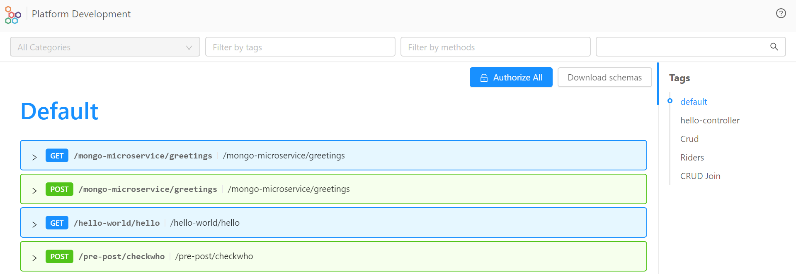

## v5.7.3 (May 27,2020)

### New features

* **Templates**
         **New template interpolation strings** `mia_template_image_name_placeholder`, `mia_template_project_id_placeholder`, `mia_template_service_name_placeholder` for custom plugins have been added. These strings, being compliant with Node, Java, Go and other languages requests, allow templates to have their own CI. You can learn more about templates configuration at this [page](https://docs.mia-platform.eu/development_suite/api-console/api-design/templates_conf/) of Mia Platform Docs.

:::info
Old interpolation strings `CUSTOM_PLUGIN_PROJECT_ID`, `CUSTOM_PLUGIN_SERVICE_NAME`, `CUSTOM_PLUGIN_PROJECT_NAMESPACE` and `CUSTOM_PLUGIN_IMAGE_NAME` are now deprecated.
:::

### Improvements

* **Configmaps**
    The size of the configmaps generated for core services **has been reduced**.

### How to update your DevOps Console

In case of on-premise Console, to use these features, you have to update:

* Console Backend @1.22.0 (`nexus.mia-platform.eu/api-console/backend:1.22.0`)

## v5.7.2 (May 26,2020)

### New features

* **API Portal**
    With the new *Download Schemas* button you can now **download your API specification** in *OpenAPI 3* or *Swagger 2* format.

    

    

:::info
In order to update the API Portal, you have to access the DevOps Console, select your project and commit and deploy your configurations.
:::

* **API-Gateway configmaps**
    Now you can configure the API-Gateway extensions, in the Advanced section of DevOps Console, to **manage the custom maps for Nginx**.

### Improvements

* **Setup Infrastructure**
    Due to the high number of variables, Environment Variables table **supports now pagination**.

* **Console Menu**
    The **Documentation** menu item will not be displayed in the DevOps Console drawer menu for projects that does not have it.

### Fixes

* **Branch**
    Resolved an issue affecting **branch loading** when selecting the DevOps Console *Design* area.

* **Console Homepage**
    **Homepage cards** have been restyled to avoid displaying a cut shadow below the card when hovering with the mouse.

    

* **Resize alignment and reading improvement** of columns in the Pre/Post section of DevOps Console.

### Marketplace

New Examples have been published:

* **springboot-hello-world-example**: example that uses the Mia Platform Custom Plugin Java. [Here](https://github.com/mia-platform-marketplace/springboot-hello-world-example) you can learn more about this example.

* **python-falcon-hello-world-microservice-example**: simple python example using falcon framework. [Here](https://github.com/mia-platform-marketplace/python-falcon-hello-world-microservice-example) you can learn more about this example.

* **python-tornado-hello-world-microservice-example**: simple python example using tornado framework. [Here](https://github.com/mia-platform-marketplace/python-tornado-hello-world-microservice-example) you can learn more about this example.

* **rust-hello-world-example**: simple Hello World application. [Here](https://github.com/mia-platform-marketplace/rust-hello-world-example) you can learn more about this example.

* **cpp-oatpp-hello-world-microservice-example**: simple example of application in C++ that uses Oat++. [Here](https://github.com/mia-platform-marketplace/cpp-oatpp-hello-world-microservice-example) you can learn more about this example.

### How to update your DevOps Console

In case of on-premise Console, to use these features, you have to update:

* Console website @1.21.0 (`nexus.mia-platform.eu/api-console/website:1.21.0`)
* Console backend @1.21.0 (`nexus.mia-platform.eu/api-console/backend:1.21.0`)
* Infrastructure Website @1.3.1 (`nexus.mia-platform.eu/console/infrastructure-website:1.3.1`)

Moreover, you have to set the following Feature Toggles to `true`:

* `FT_ENABLE_CREATE_CONFIG_MAP_CUSTOM_SERVICE`
* `FT_ENABLE_CREATE_PROJECT_ON_INFRASTRUCTURE_WEBSITE`
* `FT_ENABLE_CRONJOB`
* `FT_ENABLE_INFRASTRUCTURE_WEBSITE`
* `FT_ENABLE_MICROSERVICE_GATEWAY_SKIP`

## v5.7.1 (May 19,2020)

### Improvements

* **Console**

    From CMS it is now possible to configure different default environment variables for each template, in order to **overwrite the default environment variables applied by DevOps Console**. You can configure the environment variables by adding `defaultEnvironmentVariables` inside the data model of each template. To learn how to use this new feature, please visit this [page](https://docs.mia-platform.eu/development_suite/api-console/api-design/templates_conf/#how-to-configure-templates-default-environment-variables-from-cms) of Mia Platform Docs.

* You have now the possibility to **resize columns** in the Pre/Post section of DevOps Console.

    

    

### Fixed

* **Deploy**

    Horizontal Pod Autoscaler (HPA) file is  **generated with *.yml* extension** instead of *.yaml*. So, HPA files can now be deployed successfully.

:::info
Mia Platform recommends you to delete al the *.hpa.yaml* files and to mantain all the *.hpa.yml* files.
:::

### How to update your DevOps Console

In case of on-premise Console, to use these features, you have to update:

* Console website @1.20.0

* Console backend @1.20.0

## v5.7.0 (May 12,2020)

:::info
This version solves the breaking change of v5.6.1: now CMS backend does not go in error. If you have configured 'cmsmenu' CRUD, the menu items will be shown in CMS since 'groups' property will be automatically added.
:::

### New capabilities

* **Create and Manage Cronjobs**
  This new section of Design area enables you to **create, manage and delete CronJob**, a scheduled Job that will be executed periodically on a given schedule, from DevOps Console.

  

[Here](https://docs.mia-platform.eu/development_suite/api-console/api-design/jobs-cronjob/) you can find more details about CronJobs creation and management.

### New features

* **Design - Microservices: add a configmap**
    With this version we have introduced 'add configuration' button that allows you to **create configmaps** in order to add files to your microservice without going to the advanced configuration.

  
* **Design - Microservices: switch to standard mode without loosing information**
    We have simplified the **switch from advanced to standard mode** in the Microservices section. Now, in fact, you can come back to standard configuration **without loosing your advanced settings** like your docker image, your variables and your configmaps.

 

:::info
We suggest you to convert in a standard mode all your microservices in order to achieve a better governance of your microservices.
:::

  [Here](https://docs.mia-platform.eu/development_suite/api-console/api-design/services/) you can find more detailed guidelines about the creation and the management of configurations from DevOps Console.

### Improvements

* **Design - Microservices, Cronjobs and Proxies**
    Restyling of Microservices, Cronjobs and Proxies deletion: now, on the footer of the page, there is a **card with the 'delete' button**. If you push it, a pop up appears in the centre of the page to confirm the deletion.

  

* **Design - Microservices**
    Restyling of Microservices page: name, tag, 'Clone' and 'View Repository' remains **on the header of the page** when the user scrolls down the page.

  

### Fixed

* **CMS**
  **Logout from CMS is fixed** and returns a feedback in case of error. Moreover, v1-adapter has been updated to version 2.4.0, cms-site to version 9.8.1 and cms-backend to version 3.0.0

* **Restyling** of the padding between the Search bar and first input selected in each section of Design area.
  
* Improvement of the **organization of the elements** of DevOps Console pages when the width of the window is reduced.

  

### How to update your DevOps Console

In case of on-premise Console, to use the previous features, you have to update:  

* Console website @1.19.0

* Console backend @1.19.1

If you have a custom CMS, you have also to update it at v9.8.1.
