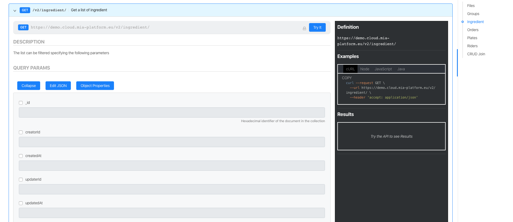

:::warning  
**BREAKING CHANGE**

* Convert api-gateway configuration to handle new proxy name and remove group expressions from api-gateway
* Update api console configuration to handle update of config-extension and set active authorization-service( if session-manager service is active) into project enabledServices

:::

### Authorization Service and Auth0Client Service

Mia Platform boost their security and authentication system with 2new microservices.

* Read [here](https://docs.mia-platform.eu/development_suite/api-console/api-design/how_to_enable_auth0/) how to enable this new authentication and authorization mode.
* [Auth0Client](https://docs.mia-platform.eu/runtime_suite/auth0-client/how_to_use/) : This service handles authentication and user management using auth0 as an identity provider.  
* [Authorization Service](https://docs.mia-platform.eu/runtime_suite/authorization-service/how_to_use/): This service exposes an /auth endpoint that, once that you have provided a configuration, handles the access to a specific combination of route and method.  

### DevOps Console

**General**

* You’ll find a new service that sends you alerts, warnings, and notifications about new content.

  

* Show modal for selecting branch: after the choice of a project you can choose a branch.
* New MenuItem style on hover: if your endpoints are too long you can see it on hover.

**Fixed**:

* Fix deleteArea in Analytics & Collections container  
* Fix word-breaking in service container  
* Fixed alignment dialog box  
* Fixed children menuItem path  
* Removed Marketplace links
* Fixed export service configurations for the openshift orchestrator (exportServiceConf renamed to exportServiceConfig)

**Service Area**

* Added exposeSwagger switch to Services: if your services expose the route /documentation from the console you can active a flag and show the route of the services direct in the API Portal

  

**Endpoint Area**

* Changed style in endpoint page - we separate each area with a card  
* Added remove route functionality: now you can delete a subroute custom that you have created.

    

**CRUD Area**

* Field type of *_id* in CRUD can be edited  
* Allow [TTL Indexes](https://docs.mongodb.com/manual/core/index-ttl/)
* Allow [Wildcard Indexes](https://docs.mongodb.com/manual/core/index-wildcard/)
* Fixed: if an index field cannot be deleted, the delete is disabled
* Change delete button indexComponent  

### Upgrades  

api-portal to 1.7.0  
crud-service to 2.1.2  
v1-adapter to 2.3.0  
cms-backend to 1.4.0  

#### API PORTAL v1.7.0

**Added**:

* Api-explorer with new form

* Add button to authenticate all routes

* Edit data form using a json

**Fixed**:

* Remove Menu from the Header  
* Choose type of data field  

#### CRUD SERVICE v2.1.2

* Fix CRUD startup with 0 collections
* Handle ttl index
* support *_id* of type string

#### V1-ADAPTER 2.3.0

* Add export in excel
* Export with columns passed from query params
* Cookie forward on /users/logout;
* Implemented auth-adapter for adapting users-related requests to Auth0Client;
* Using HEADERS_TO_PROXY list into requests towards export service.

#### CMS BACKEND 1.4.0

* Add client-key endpoint to set client-key cookie

### NEW SERVICES: SQL INVOKER

Sql Invoker is designed to invoke stored procedure and/or stored function.  
In this moment, the service supports only:
Stored procedures that does not return result sets and consequently: performs database side effects get results from INOUT and OUT parameters

**CMS v6.1.0**

* The /count calls are no longer blockers to open a resource  
* Fix to the gallery page and to paging  

**CMS v9.5.0**

Evolution of export functionality.
From now on it is possible to export only some properties of the collection.

**CMS v9.4.0**

With this version we have made it possible to navigate between collections via links.
This allows you to quickly go from one property to another collection while maintaining the reference to the property

[At this link the details on how to configure it](../business_suite/conf_cms.md)
