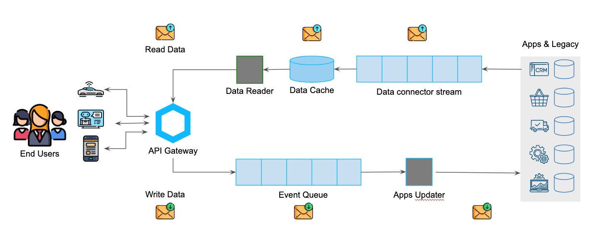

* A single point of access to all the data contained in the integrated systems

* Data updated in near real time

* Data exposed 24/7 (the management systems are turned off at night)

* A single representation of data coming from different systems

* A data model designed according to business needs

