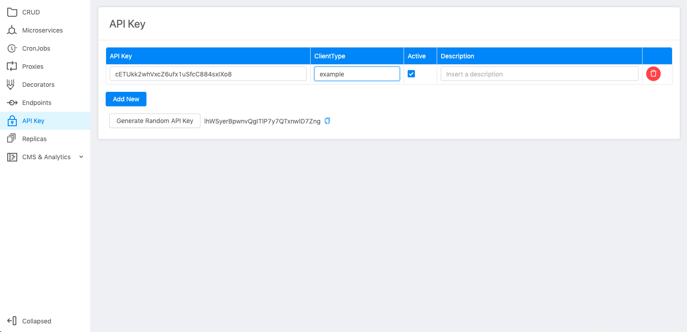
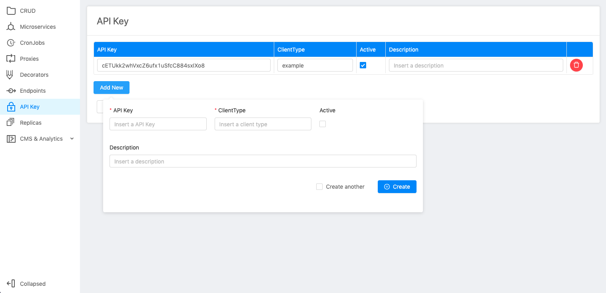
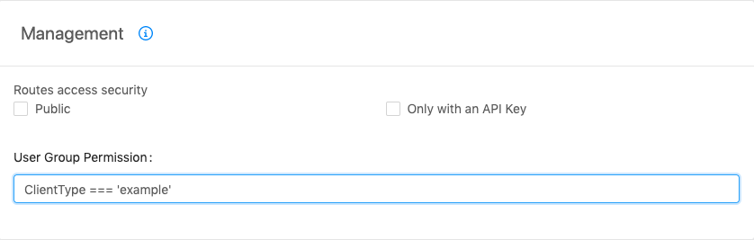

## ApiKey

In order to create a new API key, open the dedicated section, press **Add new** button and fill in the following information:

* **Api key value**: insert a secure apikey. You can populate this field by using *generate random API key*;
* **Client type**: a name for your API key;
* **Active**: a field used to enable or disable the API key;
* **Description**: a field used to describe the apikey usage information;

:::note API key section

:::

:::note API key creation form

:::

:::info
You can generate the API key value by using *generate random API key* button
:::

### Link ApiKey to an endpoint

Once you've created your key, go to endpoints sections in management area in *User Group Permission* 

:::note Example endpoint management section

:::
