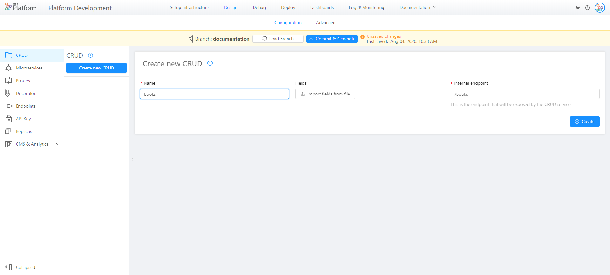

## Create a new CRUD

:::info
CRUDs created in the Console are handled and exposed to the services within your project by the [Crud Service](../../../runtime_suite/crud-service/overview_and_usage.md)
:::

In order to create a new CRUD, open the dedicated section, select **Create new CRUD** and fill in the following information:

* **Name**: the name of the CRUD that will be used for data storage (we recommend using `snake-case` as naming convention). In our case, we will name the collection “books”;
* **Internal endpoint**: this is the first endpoint that will be exposed by the [Crud Service](../../../runtime_suite/crud-service/overview_and_usage.md). The console will prefill it but you can change it according to your preference.



Once you have entered all required fields, press the **Create** button on the right and you will see your newly created CRUD.

As soon as you push **Create** a new page, "books" in our example, is created and you can enter a short and optional description of your collection: default description will be “Collection of books”.

In the section **Fields**, you can enter the properties of your collection.
By default, there are fields that can not be changed, such as: `_id`, `creatorId`, `createdAt`, `updaterId`, `updatedAt`, `_STATE_`.

You can add new fields by selecting **Add new** and fill in the blank form with the value you need.


You can add the fields you need and select the appropriate properties:

* **name** (we recommend using `camelCase` naming convention); in our case we will insert "title", "author", "year", "new", etc.
* **type**:
  * **string** if it is a classic text string
  * **number** if it is a number
  * **date** if it is a date. The date it must be a string **compliant with ISO-8601 standard** with the following format: *YYYY-MM-DDTHH:mm:ss.sssZ*
  * **boolean** if it can only be `true` or `false`
  * **Geopoint** if you want to save a specific place coordinates
  * **Array** if you want to save as an ordered set of properties
  * **Object** if you want to insert an object.
* If you select **required** the property is mandatory.
* If you select **nullable** you can make the value *null*.
* In the **description** field you can enter a short optional description.


### CRUD Service exposed routes

The [Crud Service](../../../runtime_suite/crud-service/overview_and_usage.md) will handle your data model and expose its API to the services within your project, without the need to expose the CRUD to the outside world, by using the specified CRUD endpoint routes in the dedicated card in CRUD detail view.

If you want the CRUD to be accessible from the outside, you can create a new CRUD-type Endpoint in the [**Design Endpoint section**](./endpoints).

Beyond the first route, automatically exposed when creating the CRUD, you can always **add new routes** and **modify existing ones**.
When viewing CRUD detail information you can view all the internal routes associated with your CRUD and edit them.
In our case we will see the first internal endpoint with a **routh base path** equal to "/books". The _default state_ (used on document creation) is set to _DRAFT_ by default.


To create a new endpoint click on the `Add new` button in the card and fill in **Route base path** and the **Default state** property for the new endpoint.

Please note that these endpoint must be unique through all the configured CRUD, the Console will check for you that this constraint is satisfied when creating or editing any CRUD route in your project. In case this happens you will be warned with an error message.


You can always change the default state of an existing route by simply clicking on the field default state. The two possible values are _DRAFT_ or _PUBLIC_.

You can delete a route but you must always leave at least one endpoint exposed by the [Crud Service](../../../runtime_suite/crud-service/overview_and_usage.md), otherwise the CRUD won't be accessible by anyone, neither your services in your project.

### How to create the fields of your CRUD by importing a JSON

If you want, you can upload your fields from file, selecting **Import fields from File**.
Remember that the file must be a JSON with the following directions:

* Enter the property `name` in camelCase
* Add properties with their `types` spelling as follow:
  * `string`
  * `Date`
  * `number`
  * `boolean`
  * `GeoPoint`
  * `RawObject`
  * `Array_string`
  * `Array_number`
  * `Array_RawObject`
* `required` must be `false` or `true`
* `nullable` must be `false` or `true`

`RawObject` and `Array_RawObject` support both a custom JSON Schema.  
It can be used to specify the schema of the object for the former and the schema of each item of the array for the latter.

To do it, add a property *schema* to the field.  
The following options are supported:  

- `properties`: must be a valid 'properties' field of a json schema of type *object*.
- `required`: array of name properties that are required. It's the **required** field of a JSON schema of type *object*.
- `additionalProperties`: boolean, `true` if the object can have additional properties.

This is an example of a field of type `RawObject` where is specified the schema object the properties of the object (*properties*), the required properties (`somethingNumber`) and if object could accept additional properties (in this example it is set to false):

```json
{
  "name": "fieldObject",
  "type": "RawObject",
  "schema": {
    "properties": {
      "somethingArrayObject": {
        "type": "array",
        "items": {
          "type": "object",
          "properties": {
            "anotherNumber": { "type": "number" }
          },
        }
      },
      "somethingNumber": {
        "type": "number"
      },
      "somethingObject": {
        "type": "object",
        "properties": {
          "childNumber": {
            "type": "number"
          }
        },
        "additionalProperties": true
      }
    },
    "required": [
      "somethingNumber"
    ],
    "additionalProperties": false,
  },
  "required": false
}
```

The following is an example of `Array_RawObject` (*Array* of *RawObject*) with the JSON schema of the object items.  

```json
{
  "name": "fieldArrayOfObjects",
  "type": "Array_RawObject",
  "schema": {
      "properties": {
      "name": {
        "type": "string"
      },
      "neastedArr": {
        "type": "array",
        "items": {
          "type": "number"
        }
      },
    },
    "required": [
      "name"
    ],
    "additionalProperties": false,
  },
  "required": false
}
```

Here, *schema* refers to the object of each item (which are of type `RawObject`). It's NOT the schema of the array itself.  
So, each item of the array must follows the following rules:

- *name* property must be a string ad it is required
- *neastedArr* property must be an array of numbers
- can have additional properties

The schema specified in *properties* (for both of them) **cannot** have the following operators:

- `oneOf`
- `anyOf`
- `allOf`
- `if`
- `$ref`

Here's an example of the file to upload.

```json
{
  "name": "updatedAt",
  "type": "Date",
  "required": true,
  "nullable": false,
  "description": "updatedAt"
},
{
  "name": "__STATE__",
  "type": "string",
  "required": true,
  "nullable": false,
  "description": "__STATE__"
},
{
  "name": "PublicationDate",
  "type": "number",
  "required": true,
  "nullable": true
},
{
  "name": "new",
  "type": "boolean",
  "required": true,
  "nullable": false
},
{
  "name": "location",
  "type": "GeoPoint",
  "required": false,
  "nullable": false
},
{
  "name": "Writer",
  "type": "RawObject",
  "schema": {
    "properties": {
      ...
    },
    "required": ["fieldname1"],
    "additionalProperties": true
  },
  "required": false,
  "nullable": false
},
{
  "name": "editors",
  "type": "Array_string",
  "required": false,
  "nullable": true
},
{
  "name": "editions",
  "type": "Array_number",
  "required": false,
  "nullable": false
},
{
  "name":"shops",
  "type":"Array_RawObject",
  "schema": {
    "properties": {
      ...
    },
    "required": ["fieldname1"],
    "additionalProperties": true
  },
  "required":true,
  "nullable":true,
  "description":"where to find the books"
}
```

Once you imported the JSON from files, it automatically appears in the table under the default fields.

If you want to delete a row, select red trash symbol on the right of the the table.


:::warning
The collection **has not yet been saved** it is necessary to continue the process described below
:::

### Indexes

You can configure the indexes, a data structure designed to improve search (query) data.

After selecting a CRUD, to create a new index select **create new** in the "Indexes" section.
Once you named the index you need to choose among: geo, hash or TTL. Then, you can choose whether to make the index unique by ticking "unique".


## CRUD API Documentation

After the [deploy](../../deploy/deploy), you will find your CRUDs API Documentation available on the [API Portal](../../api-portal/api-documentations).

To take in deeper how to use API exposed by the CRUD Service check out the [CRUD Endpoints Documentation](../../../runtime_suite/crud-service/overview_and_usage#crud-endpoints).
