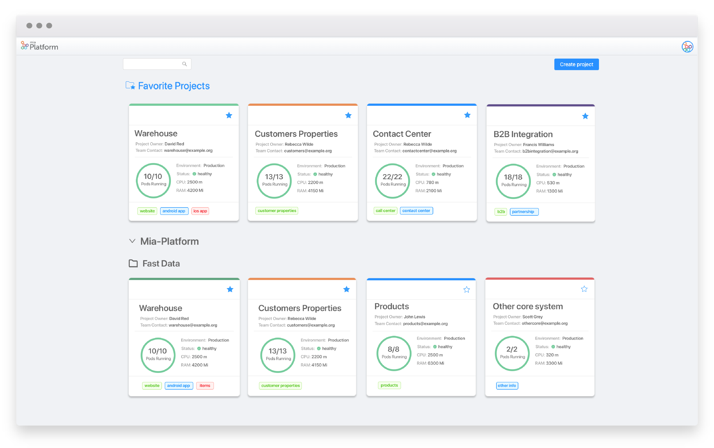
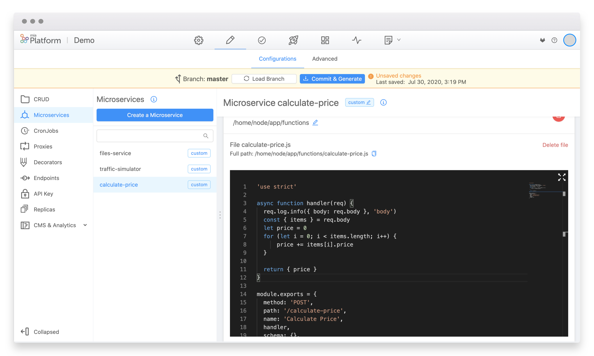
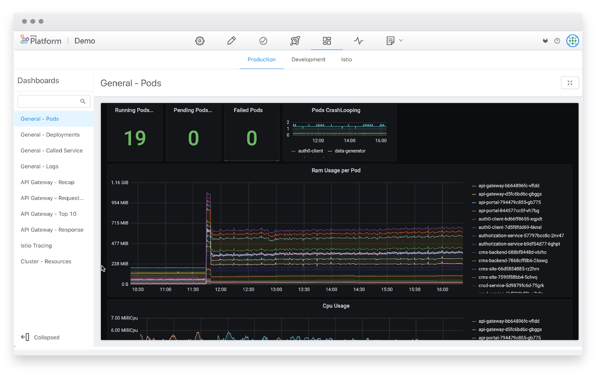

:::tip New major version
We are happy to announce the new release! Mia-Platform offers the simplest way to develop on Kubernetes, managing all the top cloud providers on the market: GKE, AKS, Openshift, Oracle Cloud, IBM Cloud Kubernetes Service, and now also EKS. The most relevant changes of the v6.0 are the integration with both GitHub and Gitlab, the support for serverless functions, Service Mesh capabilities, a new component to orchestrate Saga Patterns with remediation, new dashboards and alarms, integrated with Prometheus and the ELK stack.
:::

### Monitor the status of your projects at a glance and organize them into clusters and logical layers

In the Homepage of the Devops Console you will now see new card representing useful information on individual projects. Every card shows:

* Project name
* Layer label
* Project owner
* Team owner
* Numbers of pods running
* Environment
* Status
* CPU
* RAM

  You can find more info [here!](https://docs.mia-platform.eu/docs/development_suite/set-up-infrastructure/create-projectThe)

### The DevOps Console is now integrated with Github

You can choose where to save the code repository! DevOps Console now supports **GitHub** as well as **Gitlab**. You can now choose where the DevOps Console will automatically save the code among **Gitlab** or **Github**. You will also be able to login to the DevOps console directly with your **GitHub** account.

### New plugin to support serverless functions

In the DevOps Console marketplace you will now find a new ready-to-code plugin named **function service**. The Function service allows you to map functions to endpoints to be executed without creating a fully-fledged dedicated microservice. You can find more info [here!](https://docs.mia-platform.eu/docs/runtime_suite/function-service/configuration)

### New plugin to orchestrate your services

In the DevOps Console marketplace you will now find a readey-to-code plugin named **flow manager**. The Flow Manager is a **saga orchestrator**. It is capable to manage flows structured by using the Architectural pattern named Saga Pattern and, in particular, the Command/Orchestration approach. You can find more info [here!](https://docs.mia-platform.eu/docs/runtime_suite/flow-manager/index)

### New dashboards available in the DevOps Console

The DevOps Console now supports a wide range of monitoring dashboards. Thanks to the integration with**Prometheus**and**Grafana**it will now be possible to monitor the status of your**Kubernetes** clusters directly from the DevOps Console. You will be able to monitor the number of pods, cpu and memory consumption. Monitoring your IT systems has never been easier!
The DevOps Console now also integrates the functionality of Istio as service mesh.
 You can find more info [here!](https://docs.mia-platform.eu/docs/business_suite/data-visualization#dashboard-configution)

### How to update your DevOps Console

For on-premise Console installations, you have to use the [Helm chart version](https://git.tools.mia-platform.eu/platform/devops/console-helm-chart) version `2.3.12`.
