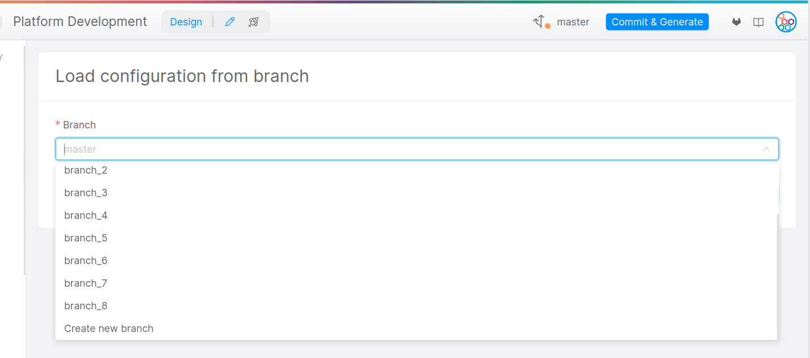

The Design section allows you to modify the configuration and architecture of your project by customizing the use of various resources such as CRUD, Microservices, Endpoints and much more.

Using the sidebar it is possible to navigate between the different subsections of the Console, through which configure and design any resource of your project.

## Manage your configuration

Mia-Platform Console allows you to manage the configuration of your project using GIT branches. Branches represent independent lines of development that can be originated starting from any commit. They are used to develop and test different configurations, as changes to one branch do not cause any changes to others, and any branch can be deployed. 

In the Design Area, you can use the top-right corner to change branch, create a new one or save your work.

### Branch status

The little circle on the branch icon helps you understanding if there are any unsaved changes according to its color:
- Green: everything you have done in the Design Area has already been saved;
- Orange: there are some unsaved changes that need to be committed on your branch. Until you do such thing, if you leave the Design area or reload the page, you will lose your work;
- Red: there is a problem with your configuration. You may need to reload the page.

Furthermore, at the mouseover on the branch name, you can see a tooltip displaying when is the last time the branch has been updated.

### How to load a branch

In order to switch to another branch, you just need to click on its name to open the Load area. There you can select the new branch to be loaded or, alternatively, at the bottom of the respective drop-down menu you can create a new one.

### How to save and commit

Once the respective desired changes have been made, using the "Commit & Generate" button in the topbar you will be redirected to the dedicated area.
