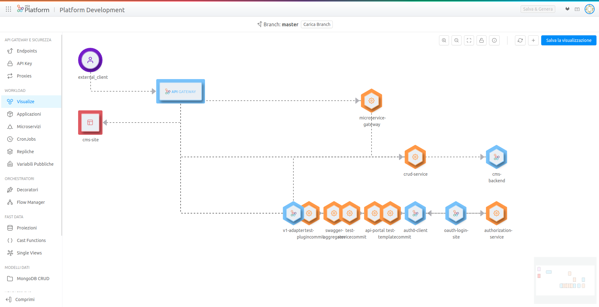

## v7.3.1

_April 2, 2021_

### Bug Fix

#### Incorrect configuration download

The download of the branch configuration was not working correctly because of a missing property. 

### How to update your Console

For on-premise Console installations, please contact your Mia Platform referent to know how to use the `Helm chart version 3.6.1`.

## v7.3.0

_March 31, 2021_

### New Features

#### Visualize your projects

[Mia-Craft](../development_suite/api-console/api-design/miacraft.md) is a visualization tool that allows the user to see graphically the microservices in the project and to recreate the conceptual flow adopted during the design of the project’s configuration.
You can now access it by opening the Visualize tab in the Design Section of Mia-Platform Console. Read the documentation for additional information.

#### Updated libraries for NODE_EXTRA_CA_CERTS

Libraries that handle CA certificates have been updated and it is now possible to use self-signed certificates to send requests to an external backend server.

#### dockerImageNameSuggestion customization from tenant

The property `dockerImageNameSuggestion` has been added to [tenants](../development_suite/set-up-infrastructure/create-project#create-a-tenant). The property is inherited by new projects in the tenant and allows you to customize the suggestion for the "Docker Image Name" field during the [creation of a microservice](../development_suite/api-console/api-design/services#how-to-create-a-microservice-from-an-example-or-from-a-template).

### Breaking Changes

#### Projection changes and System of Record association

The [projection changes](../fast_data/create_projection#projections-changes) collection is not global for all [Systems of Record](../fast_data/create_projection#create-a-system-of-record) anymore. Now, for each System of Record, there is a specific projection changes collection.

If you are not using a custom `projection-changes-collection` and you have important information in the collection `fast-data-projection-changes` (e.g. kafka messages have been sent by CDC but they have not been consumed yet), you need to move them in the new `projection-changes` collections.  
Please read the [projection changes documentation](../fast_data/create_projection#projections-changes) to know how to find them.  
Remember also to update the name of the projection changes collection towards which the [single-view-creators](../fast_data/configure_single_view_creator) point.

As an alternative, you can keep using the collection `fast-data-projection-changes` by configuring it as a custom `projection-changes-collection` from the [advanced](../fast_data/advanced#projections-changes) section.

### Bug Fix

#### Compare table visibility

In the [Deploy area](../development_suite/deploy/deploy#deploy-area), the Compare table was not visible in new projects before the first deployment in a specific environment. Now the table correctly displays the microservices that will be deployed at the first release.

#### Excessive annotation's name length

Fixed a bug causing the impossibility to Deploy in projects using `Mia-Platform pipelines v3` with microservices with particularly long names.

### How to update your Console

For on-premise Console installations, please contact your Mia Platform referent to know how to use the `Helm chart version 3.6.0`.
