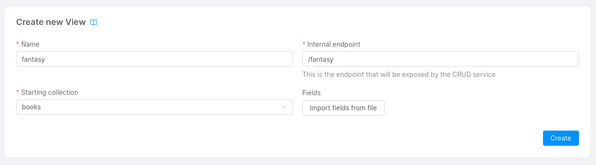
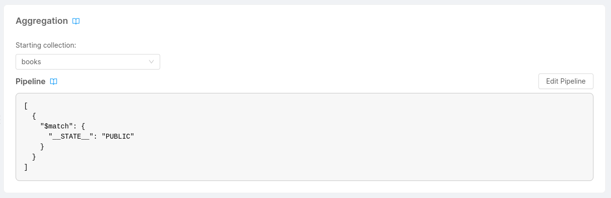

## What is a MongoDB View?

> A MongoDB view is a queryable object whose contents are defined by an aggregation pipeline on other collections or views. MongoDB does not persist the view contents to disk. A view's content is computed on-demand when a client queries the view. MongoDB can require clients to have permission to query the view.   

[Source](https://www.mongodb.com/docs/manual/core/views/#views)

## Create a new View

A View requires a `source` collection from which the aggregation starts.   
The *Internal Endpoints* is the path from which the view is going to be exposed by the [CRUD Service](/docs/runtime_suite/crud-service/overview_and_usage) inside the namespace. Additional internal endpoints can be defined in the Internal Endpoints card of the View. Only paths with `GET` methods are exposed, since you can perform only `read` operation on a view.

The data exposed by the view are the result of a series of step the data of the `source` collection are going through. These steps are defined in the `pipeline`, and can filter, group, join, project or transform the data. These steps compose the so-called [aggregation pipeline](https://www.mongodb.com/docs/manual/core/aggregation-pipeline/).

MongoDB will run an [aggregation pipeline](https://www.mongodb.com/docs/manual/core/aggregation-pipeline/) starting from the `source` collection.    
When you create a new view, the console will set a default pipeline which returns only `PUBLIC` documents. You can edit it through the dedicated editor.   

:::note
The whole aggregation pipeline is going to be performed on-demand on each request the view received.   
If you expect to perform complex aggregation with many collections involved, or several amounts of documents involved in each request, you may consider using a [**Fast Data Single View**](/fast_data/configuration/single_views.md) instead. In fact, a MongoDB View perform aggregation on reading, the Fast Data Single View perform the aggregation on writing of the source collections (called **Projections**) and it's so a better choice for data-intensive aggregation.
:::

:::caution
This feature is available from version `5.2.2` of [CRUD Service](/docs/runtime_suite/crud-service/overview_and_usage). Creating a view while using a lower version of CRUD Service would make it crash at boot.
:::

### Fields

Fields you are defining in a View are the fields you expect to have at the end of the aggregation. 
Fields types can be the same of the [MongoDB CRUD](/docs/development_suite/api-console/api-design/crud_advanced#fields), nested fields are supported as well. 
Unlike MongoDB CRUD, you cannot set indexes on these views' fields instead, because they are going to use indexes of the underlying collection. To know more about it, please refer to the [official documentation](https://www.mongodb.com/docs/manual/core/views/#index-use-and-sort-operations).

### Expose through endpoints

The [CRUD Service](../../../runtime_suite/crud-service/overview_and_usage.md) will handle your data model and expose its API to the services within your project. If you need to make the API consumable from the external of your namespace, you can create an [Endpoint](/docs/development_suite/api-console/api-design/endpoints) of type `MongoDB View` connected to one of the `Internal Endpoints` of your view. 

Since the internal endpoint of a MongoDB View can be used only for reading operations, the endpoint will expose only `GET` routes as well.

### CMS

The CMS offers a fast and intuitive way to visualize a MongoDB View's information without the need of manually sending http requests.

To see a MongoDB View's content from the CMS you will need to [create a new CMS Page](/docs/microfrontend-composer/previous-tools/cms/config_cms.md#how-to-create-a-page) from the CMS section of the console. In the first step (Menu configuration) of the creation form you want to select as `Endpoint` the previously created endpoint connected to your view. Now in the second step (CMS Settings) you will notice there are two disabled options, the `Enable delete` and the `Avoid the creation of new elements`.

This is because, as we said earlier, a MongoDB View can only be used for reading operations. Consequently, the deletion and creation of elements is disabled.

Now finish the creation as you would with any other endpoint and visit the CMS portal to see the results.