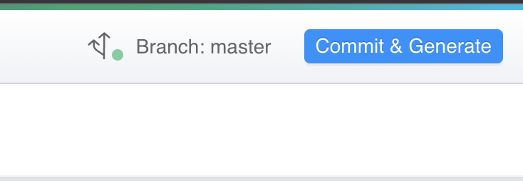

_May, 27th 2022_

## Console

### New features

#### Automatic creation of application resources

[Mia-Platform applications](https://docs.mia-platform.eu/docs/marketplace/applications/mia_applications) become more and more powerful!
Starting from now, all the application in the marketplace will also be able to automatically create Endpoints, Public Variables and CRUD Collections.
In this way, with a few simple clicks you can deploy perfectly functional applications without configuring absolutely anything!

#### Welcome to MongoDB Views section!

The [MongoDB View section](../../development_suite/api-console/api-design/mongo_views) has been introduced inside the Design area of the Console.
Here, user can create and configure a View.
Then, the view can be exposed through an Endpoint of type MongoDB View.
Moreover, it is possible to see a MongoDB View's content from the CMS by creating a [new CMS Page](../../business_suite/cms_configuration/config_cms#how-to-create-a-page) from the CMS section of the Console.

:::caution 
This feature is available from version 5.2.2 of CRUD Service. 
Creating a view while using a lower version of CRUD Service would make it crash at boot.
:::

### Add Microsoft as Console auth provider

It is now possible to set Microsoft as a new OAuth2 providers to log in to Console! It is possible to enable it from the Helm Chart for the on-premise installation.

### Improvements

**New experience for commit and tag**

The save process is being thoroughly revised. This version features a new way for saving the configuration and create a tag.
More improvements will come in the next versions.

**Add user from the Project User Portal**

Company Owners can now add a new user into their Company directly from the Project User Portal, assigning also specific capabilities for the specific project.

**Security Features at Company and Project level**

It is now possible to set a series of security features in the CMS area to harden the project configuration and limit what an external actor can do if access inside the container is gained.
These security features will be enabled by default at the next save and [can be disabled from the CMS](https://docs.mia-platform.eu/docs/development_suite/api-console/api-design/security) if compatibility problems occur.

**New Filter in Endpoint Overview**

The filters in the Endpoint Overview page are more generic: the user can choose the field and the value of each filter.
Host, method and endpoint are split in three different columns.
Filters and column visualization are encoded in the URL.

**API-key presence is no more mandatory**

In the creation of a project, the configuration step for the API key has been removed.
Moreover, it is possible to save project configuration without having set any API-key.

**Filtering of projects by using a specific query parameter directly in the browser url**

It has been allowed to search projects by using a specific query parameter from the console homepage.

**Changed default state to PUBLIC for MongoDB CRUD**

By creating a new collection, the status of its internal endpoint is set as PUBLIC state instead of DRAFT one.

**The field name of collections accepts empty spaces** 

It is possible to include empty spaces in the field name of collections in MongoDB CRUD section.

**Redesign of Manual Routes drawer in RBAC section** 

The drawer in Manual Route tab inside the RBAC section has been adjusted to improve user experience in adding and managing manual routes.

## Fast Data

### Improvements

#### Manageability of dependencies resolution order in aggregation schema

From v4.1.0 of Single View Creator, it is possible to specify the resolution order of the dependencies inside the aggregation schema.
To discover how, check this [example](../../fast_data/configuration/single_view_creator/low_code.md#set-resolution-order-of-dependencies) from the documentation.

#### The field name of projections and single views accepts empty spaces 

It is possible to include empty spaces in the field name of projections and single views.

### Bug Fix 

#### PC sorting removed from single view creator reading from MongoDB

Single View Creator no more uses sorting while reading Projection Changes from MongoDB due to performance reasons.     
This fix is available in v4.1.1 for plugins (Single View Creator plugin and Low Code).     
If you are using a Single View Creator Template, you can take advantage of this fix updating the `@mia-platform-internal/single-view-creator-lib` to v11.0.1

## Marketplace

### New Marketplace components

#### User Manager Service v1.0.0

- The User Manager Service has been published in the Marketplace. It combines the Authentication Service and the CRUD service into a unique service for user management. For more info, please refer to the [User Manager Service documentation](https://docs.mia-platform.eu/docs/runtime_suite/user-manager-service/overview).

### Updates

#### Appointment Manager v1.3.0

- The Appointment Manager now supports recurrent availabilities

#### File service v2.4.1

- Security updates

#### PDF Service v1.0.0

- PDF Service has finally reached the v1.0.0 version making it a stable service in the marketplace

#### Updated CRUD Service to v5.3.0

- Added support for sorting on nested and multiple fields

#### Authentication Service v2.6.0

- Add support to Microsoft Oauth2 authentication

#### Envoy API Gateway

- The Envoy API Gateway plugin now supports zero downtime deployment

## How to update your Console

For on-premise Console installations, please contact your Mia Platform referent to know how to use the `Helm chart version 6.1.3`.
