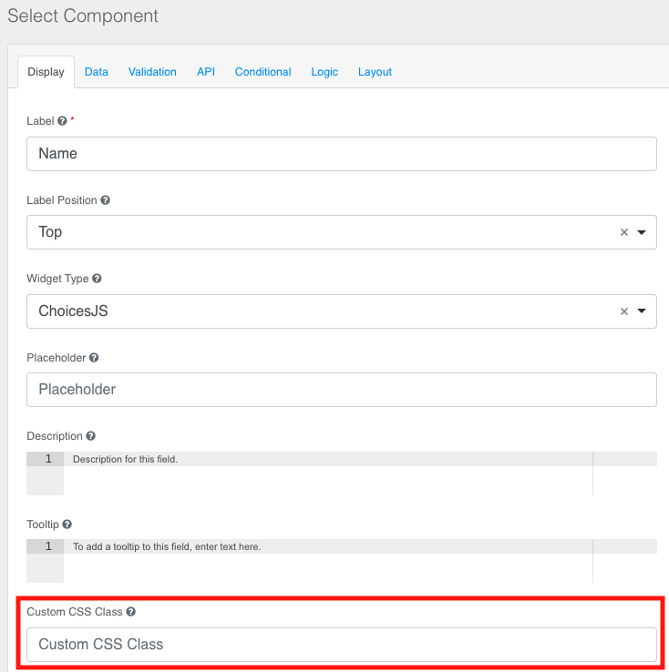

Starting with version `1.3.0`, the **Form Service Fronted** has introduced the support for **Form visualizer styling**. This feature enables an even more custom experience to end users and gives you a tool to integrate forms and questionnaires in your frontends preserving your brand identity.

This feature leverages the formio form components [custom CSS classes](https://help.form.io/userguide/forms/form-components#custom-css-class) to add custom styles to your form template. The **Form Service Backend** version `1.3.0` (or above) handles [form style assets](../form-service-backend/form_visualizer_styling_configuration#form-style-assets-crud) (such as `css` stylesheets `fonts`) that can be assigned to one or more form templates. The **Form Service Frontend** will add those resources in the **Form visualizer** web page.

**Form visualizer styling** feature requires **Form Service Backend** version `1.3.0` (or above). For more information about it's configuration and how to manage **style assets** and bind them to a form template read the [*Form visualizer styling* configuration](../form-service-backend/form_visualizer_styling_configuration).

Here and example of a template compared with it's styled counterpart.



## Style a form template

While the [*Form visualizer styling* configuration](../form-service-backend/form_visualizer_styling_configuration) describes how to set up the backend service, here are provided guidelines on the Form Builder usage. In particular, to style a form template you need add custom CSS classes to one or more components.


:::info

For a correct styling you need to add CSS classes that exists in the stylesheet associated to your form template.

:::

Moreover, if you provide your resources from different domains, you need to update the [CSP](https://developer.mozilla.org/en-US/docs/Web/HTTP/CSP) of the **Form Service Frontend** in the [Console Microservice section](../../development_suite/api-console/api-design/services) adding a [configMap](../../development_suite/api-console/api-design/services) with `Runtime Mount Path` equal to `/nginx/conf.d` and adding a file name `website.conf` adding:

``` shell

location / {
  include /etc/nginx/security.d/cross-site_script.conf;
  add_header 'Content-Security-Policy' "default-src 'self'; script-src 'self' 'unsafe-eval'; script-src-elem 'self' https://cdn.form.io; object-src 'none'; style-src 'self' 'unsafe-inline' https://cdn.form.io; img-src 'self' data:; font-src 'self'" always;
  
  expires $expires;

  try_files $uri $uri/index.html /index.html =404;
}

```
